Chapter2. 도커와 쿠버네티스 첫걸음
---

### 도커 명령어와 동작방식
        docker run <image>
        docker run <image>:tag
        
   1. docker run 을 실행하였을 때 도커가 하는 일
      - 로컬 머신에 이미지가 저장되어 있는지 확인 
      - 로컬에 이미지가 없으면 레지스트리(도커허브)로 부터 이미지를 pull
      - 격리된 컨테이너에서 이미지를 실행
      - :tag가 없다면 최신본을 사용하는 것으로 간주된다. 
      
   2. 이미지를 위한 Dockerfile 생성  
      - 애플리케이션을 이미지로 패킹하기 하려면 Dockerfile 이라는 파일을 생성한다. 
      - 도커파일 예제  
        
            1   FROM adoptopenjdk/openjdk11:ubi 
            2   RUN mkdir /opt/app
            3   COPY build/libs/com-workbook-crane-0.0.1-SNAPSHOT.jar /opt/app
            4   CMD ["java", "-jar", "/opt/app/com-workbook-crane-0.0.1-SNAPSHOT.jar"]
 
      라인 1 : FROM <image>은 *이미지 생성의 기반이 되는 기본 이미지*로 사용할 컨테이너 이미지 정의  
      라인 2 : RUN <command>은 컨테이너 에서 실행할 명령어  
        - ADD 와 RUN 의 차이  
        https://stackoverflow.com/questions/31171851/docker-build-add-vs-run-curl
               
                ADD is executed in docker host.   
                The ADD instruction copies new files, directories or remote file URLs from <src> and adds them to the filesystem of the image at the path <dest>.
                    ex) ADD app.js /app.js
                 
                RUN is executed inside your container.  
                The RUN instruction will execute any commands in a new layer on top of the current image and commit the results. The resulting committed image will be used for the next step in the Dockerfile.
                    
      라인 3 : COPY <src> <dest> 호스트 시스템에서 컨테이너로 파일 복사  
        - ADD 와 COPY 의 차이 (tar를 추출하는 것이 아니라면, 좀 더 명시적인 COPY를 사용하길 권장)  
            https://nickjanetakis.com/blog/docker-tip-2-the-difference-between-copy-and-add-in-a-dockerile
                
                   COPY takes in a src and destination. 
                   It only lets you copy in a local file or directory from your host 
                   (the machine building the Docker image) into the Docker image itself.

                   ADD lets you do that too, but it also supports 2 other sources. 
                   First, you can use a URL instead of a local file / directory. 
                   Secondly, you can extract a tar file from the source directly into the destination.

   3. 컨테이너 이미지 생성  

            docker build -t <tagname> . 
            
         - Dockerfile이 있는 위치에서 명령어를 실행 
         - 디렉터리의 전체 컨텐츠가 도커 데몬에 업로드 되어 이미지가 빌드됨
            - 빌드 디렉토리의 모든 파일이 데몬에 업로드 됨으로 불필요한 파일을 디렉토리에 포함시키면 그만큼 느려지는데, 
            특히 원격 머신에 데몬이 있는 경우 성능 저하를 가지고 온다. 
            
            - 도커 클라이언트와 데몬이 같은 머신에 있을 필요는 없는데, 리눅스가 아닌 OS에서 도커를 사용하면
             도커 클라이언트는 호스트 OS에 위치하고, 데몬은 가상머신 내부에 위치한다.
             
         - image 의 이름은 소문자만 가능하다.
         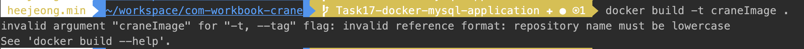

        
        //todo 78쪽 사진
        
  * 이미지 레이어  
       - 서로 다른 이미지가 여러개의 레이어를 공유할 수 있기 때문에 이미지 저장/전송에 효과적
       - 이미지를 가지고 올때도 각 레이어를 개별적으로 다운로드 한다. 
       - 이미지 프로세스가 완료되면 새로운 이미지가 로컬에 저장되고, 저장된 이미지 리스트를 도커에게 요청할 수 있다.
              
  * Dockerfile을 이용한 이미지 빌드와 수동 빌드 비교하기  
       - 도커 컨테이너 이미지를 생성하는 일반적인 방법으로 이미지 빌드를 자동화 할 수 있다.
       - Dockerfile로 빌드 하는 절차 (수동으로 할 시 아래와 같고 Dockerfile을 사용하면 변경사항만 적용하고 계속 재사용 가능) 
         1. 이미지에서 컨테이너를 실행
         2. 컨테이너 내부에서 명령어 수행
         3. 컨테이저 밖에서 최종 상태를 새로운 이미지로 커밋
         
  '4. 컨테이너 이미지 실행
  
        docker run --name crane_server -p 8080:8080 -d -t crane
        
   - "--name crane_app" 이라는 이름의 새로운 컨테이너를 실행하는 명령어이다. 
   - "-d" 백그라운드 실행을 의미
   - "-p 8080:8080" -> 로컬머신의 8080 포트가 컨테이너 내부의 8080포트와 매핑
        - 활용한 프로젝트에서는 docker-compose 파일을 사용하였고, 7070으로 포트를 띄워 매핑시켰다. 
          명령어는 "docker compose up"
          
            
      crane-app:
          container_name: crane-server
          build:
            context: .
            dockerfile: Dockerfile
          image: crane
          working_dir: /crane-app
          ports:
            - 7070:8080
          depends_on:
            crane-mysql:
              condition: service_healthy
    

 - 실행중인 모든 컨테이너 조회 
        
           
        docker ps     
    
   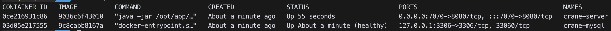
        - CONTAINER ID : 16진수의 도커 컨테이너 ID  
        - NAMES : 컨테이너 이름  
        - "docker ps -a" 을 하면 현재 정지되어있는 컨테이너도 확인 할 수 있다. 
   
 - 컨테이너에 관한 추가 정보 얻기
    
    
        docker inspect [컨테이너아이디 | 컨테이너이름]
        
   
 - "docker ps" 는 컨텡너의 기본 정보만 출력하지만 docker inspect는 도커의 상세정보를 JSON 형식으로 출력한다. 
        
        [
            {
                "Id": "d314bf4b9316ea212ae8986032de75505d9411bbdcda14a3b01a3b96a60d0f9b",
                "Created": "2021-09-27T05:00:20.9438056Z",
                "Path": "java",
                "Args": [
                    "-jar",
                    "/opt/app/com-workbook-crane-0.0.1-SNAPSHOT.jar"
                ],
                "State": {
                    "Status": "running",
                    "Running": true,
                    "Paused": false,
                    "Restarting": false,
                    "OOMKilled": false,
                    "Dead": false,
                    "Pid": 64915,
                    "ExitCode": 0,
                    "Error": "",
                    "StartedAt": "2021-09-27T05:00:57.8374213Z",
                    "FinishedAt": "0001-01-01T00:00:00Z"
                },
                "Image": "sha256:9036c6f430105a2aa235728cea12700172de3bb7d061faa3ff5dd42863ff8b84",
                "ResolvConfPath": "/var/lib/docker/containers/d314bf4b9316ea212ae8986032de75505d9411bbdcda14a3b01a3b96a60d0f9b/resolv.conf",
                "HostnamePath": "/var/lib/docker/containers/d314bf4b9316ea212ae8986032de75505d9411bbdcda14a3b01a3b96a60d0f9b/hostname",
                "HostsPath": "/var/lib/docker/containers/d314bf4b9316ea212ae8986032de75505d9411bbdcda14a3b01a3b96a60d0f9b/hosts",
                "LogPath": "/var/lib/docker/containers/d314bf4b9316ea212ae8986032de75505d9411bbdcda14a3b01a3b96a60d0f9b/d314bf4b9316ea212ae8986032de75505d9411bbdcda14a3b01a3b96a60d0f9b-json.log",
                "Name": "/crane-server",
                "RestartCount": 0,
                "Driver": "overlay2",
                "Platform": "linux",
                "MountLabel": "",
                "ProcessLabel": "",
                "AppArmorProfile": "",
                "ExecIDs": null,
                "HostConfig": {
                    "Binds": [],
                    "ContainerIDFile": "",
                    "LogConfig": {
                        "Type": "json-file",
                        "Config": {}
                    },
                    "NetworkMode": "com-workbook-crane_default",
                    "PortBindings": {
                        "8080/tcp": [
                            {
                                "HostIp": "",
                                "HostPort": "7070"
                            }
                        ]
                    },
                    
           ...  
       
  

 - 실행 중인 컨테이너 내부 접근
    
        docker exec -it crane-server bash
        
   - 실행중인 crane-server 컨테이너 내부에 접근.
   - "-i" : 표준 입력으로 명령어를 입력하기 위해 필요하. 
   - "-t" : 터미널로, 없다면 명령어 prompt 가 화면에 나오지 않는다. 
   - 빠져나올 때에는 "exit" 명령어로 빠져나올 수 있다.
  
- 내부에서 컨테이너 탐색
    
        ps aux
  - 처음 위의 명령어를 쳤을때 command not found 였고, 시도하는 모든 명령어마다 command not found 였다.
    Dockerfile 을 수정하고 사용할 수 있었는데 수정한 부분은 다음과 같다. 
    
      **before**
      
            FROM adoptopenjdk/openjdk11:ubi
            RUN mkdir /opt/app
            COPY build/libs/com-workbook-crane-0.0.1-SNAPSHOT.jar /opt/app
            CMD ["java", "-jar", "/opt/app/com-workbook-crane-0.0.1-SNAPSHOT.jar"]
             
      **after**
            
            FROM openjdk:11
            RUN mkdir /opt/app && apt-get update && apt-get -y install netcat && apt-get clean
            COPY build/libs/com-workbook-crane-0.0.1-SNAPSHOT.jar /opt/app
            CMD ["java", "-jar", "/opt/app/com-workbook-crane-0.0.1-SNAPSHOT.jar"]
    
   - 조회 하면 bash, ps aux, 그리고 실행한 app밖에 보이지 않는다. 호스트의 머신의 다른 프로세스는 볼 수 없게 격리 되어있다. 
   - 컨테이너에서 조회한 pid와 호스트 머신에서 조회한 컨테이너 프로세스의 pid가 다른 것을 볼수 있다. (격리 격리). 아래 사진 참조.
   
   **컨테이너 안에서 조회한 프로세스들과 완전한 파일 시스템** 
   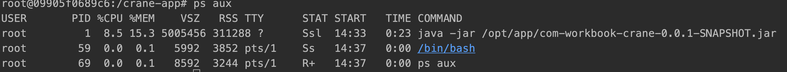
   
      
   **호스트 (로컬머신)에서 조회한 프로세스들과, 호스트에서 실행중인 컨테이너 프로세스** 
   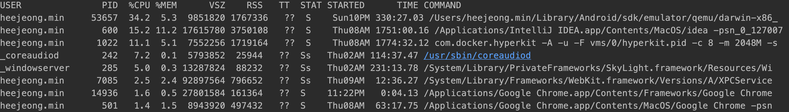
   
   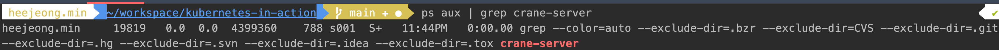
 
 
 - 컨테이너 중지와 삭제
 
        docker stop crane-server
        docker rm crane-server
      
     - stop은 컨테이너에 실행중인 메인 프로세스를 중지시키기 때문에, 컨테이너 내부에 실행되고 있는 다른 프로세스가 없어
       중지된다. 중지만 했 때문에 실행중이지 않은 전체 컨테이너를 조회하는 "docker ps -a" 명령어를 쳐보면 아직 살아 있는 것을 볼 수 있다. 기
     - 완전 삭제를 원하는 경우 rm 명령어를 사용하여 컨테너의 모든 내용을 삭제하게 된다. 
     
'5. 이미지 레지스트리에 이미지 푸시  

   - 이 기능은 로컬 컴퓨터에서만 빌드하여 사용 하던 이미지를 다른 컴퓨터에서도 실행할 수 있게 해준다. 
   - 공개된 레지스트리 중 많이 사용되는 것들은 다음과 같다. 
        - 도커 허브 (http://hub.docker.com)
        - Query.io
        - 구글 컨테이너 레지스트리 (Google Container Registry)
        
   - 이미지 푸시 순서
        1. 도커 허브 규칙에 따른 (도커허브를 선택했기 때문에) 이미지 태그 설정하는데 "도커허브아이디"/"이미지이름" 으로 정한다. 
            
                docker tag crane heejeong/crane
              
           태깅을 한 후, "docker images | head" 명령어를 통해 이미지를 확인 할 수 있는데, tag 이름만 다를 뿐 동일한 IMAGE ID를 가지고 있기 때문에 같은 이미지이다. 
           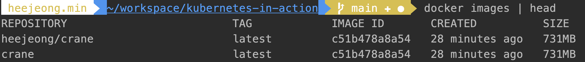
          
        2. 도커 허브에 이미지를 푸시한다. 
            
                docker push heejeong/crane 
        - 만일 "requested access to the resource is denied" 메시지가 나오면서 푸시가 되지 않는다면, 로그인을 먼저 진행하고 재시도한다.  
            
                docker login -u heejeong 
            
            도커 허브에 올라간 모습
            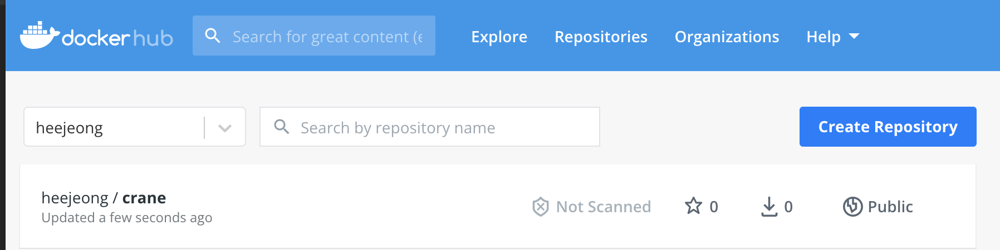
            
        3. 다른 머신에서 실행해 보기 
            
                docker run -p 6060:8080 heejeong/crane
            
            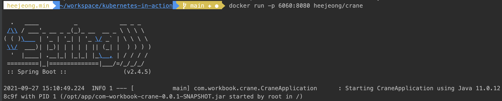
  
              
              
### 쿠버네티스 클러스터 설치

- 이 책에서는 로컬머신에 단일 노드 쿠버네티스 실행하는 방법과, 구글 쿠버네티스 엔진에 실행중인 클러스터에 접근하는 방법을 다룬다.

#### Minikube를 활용한 단일 노드 쿠버네티스 클러스터 실행
 - Minikube는 로컬에서 쿠버네티스를 테스트하고 애플리케이션을 개발하는 목적으로 설치를 도와주는 도구이다. 
 
 1. Minikube  설치  
   a. http://github.com/kubernetes/minikube 의 문서를 따라 설치
      나는 homebrew 로 설치하는 방식을 선택함. 
   b. 설치 후 쿠버네티스 클러스터를 바로 시작할 수 있다. 
        
            minikube start
 
   c. kubectl은 설치가 되어 있어서 스킵 (언제했는지 기억이 안남) 쿠버네티스를 다루기 위한 CLI 클라이언트임. 
      
   d. 시작한 cluster가 잘 작동하는지 다음 명령어로 확인할 수 있다. 
   
         kubectl cluster-info
         
   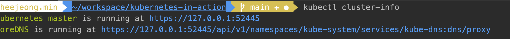 
   
 '2. 클러스의 개념 이해하기
     - 각 노드는 도커, Kubelete, kube-proxy를 실행한다. 
     - Kubectl 클라이언트 명령어는 마스터 노드에서 실행중인 쿠버네티스 API 서버로 REST 요청을 보내 클러스트와 상호작용한다. 
   
   **노드가 세개인 쿠버네티스 클러스터와의 상호작용**  
   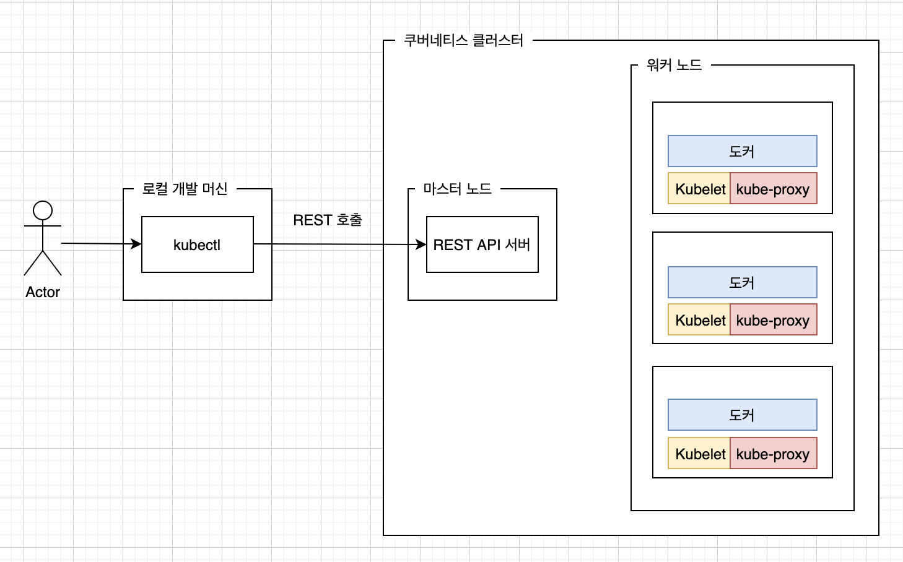 
   
   | 명령어 | 용도 | 추가설명 |
   | :-------------- | :----------- | :-------------- |
   | kubectl get nodes | 클러스터안의 노드 조회 | 오브젝트의 기본 정보만 표시 (Name, Status, Age, Version) |
   | kubectl describe node [노드이름] | 오브젝트의 상세 정보 (Cpu, 메모리, 시스템정보 ...) | node의 이름을 명시하지 않으면 전체 조회된다. |
   | kubectl describe pod [파이름] | 오브젝트의 상세 정보 (Cpu, 메모리, 시스템정보 ...) | node의 이름을 명시하지 않으면 전체 조회된다. |

  - kubectl alias와 명령줄 자동완성
    1. 나는 맥에서 zsh를 사용하니 ~/.zshrc 를 열어 다음 alias를 추가하고 저장한 후 "source ~/.zshrc" 를 실행하여 준다.  
       적용하고 나면, 앞으로 "k describe nodes" 이런식으로 사용 가능하다. 
            
            alias k=kubectl
     
            
'3. 쿠버네티스에서 애플리케이션 구동하기  
    1. kubectl run : JSON, YAML을 사용하지 않고 필요한 모든 구성 요소를 생성하는 방법
            
           kubectl run crane --image=heejeong/crane --port=7070
       
   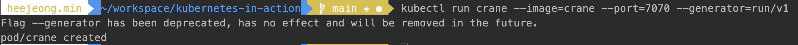 
   
   <<pod를 띄우면서 생긴 오류 1. **ImagePullBackOff**>>
        
   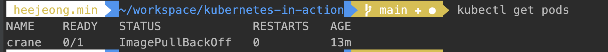
        - 파드의 상태가 ImagePullBackOff인 경우는 이미지를 가져오지 못하여서 간격을 두고 계속 pull을 시도하는 상태이다. 
          처음 생성시 이미지에 "crane"을 사용하였더니, (로컬에서 docker build -t crane . 으로 생성한 이미지) 이미지를 가져오지 못하였고, 
          도커 허브에 올라간 이미지로 하니 정상 생성되었다. ("heejeong/crane")
          -> 이유는, 로컬에서 빌드한 이미지는 로컬에서만 사용할 수 있기 때문에 도커 데몬이 실행중인 다른 워크 노드에서 컨테이너 이미지를 접근하게 하고자하여 도커 허브에 올라간 이미지를 사용한다.
        
   <<pod를 띄우면서 생긴 오류 2. **CrashLoopBackOff**>>
     - pod로 띄운 내 스프링 부터 어플리케이션이 뜨지 못해서 생기는 에러인데, 에러 로그를 확인하여야 한다. 
                   
                 kubectl logs crane
                 
   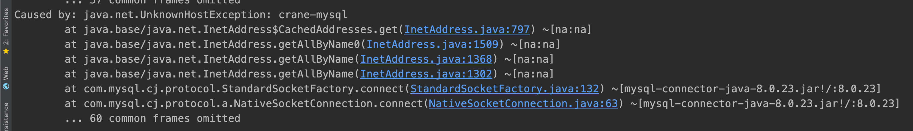
           
   위 명령어를 통하여 확인하니, 기대했던데로 db 연결을 하지 못하였기 때문에 db연결을 그런데 crane-mysql로 시도하고 있었다.      
   crane-mysql은 내가 로컬에 띄운 mysql의 서비스 이름인데 로컬에서 docker-compose 만을 가지고 띄웠을때는 crane-mysql을 
   호스트 이름으로 잘 찾았으나, kubernetes로 띄우니 못찾는 현상이였다. 
   
   도움 받은 stackoverflow : https://stackoverflow.com/questions/50952240/connect-to-local-database-from-inside-minikube-cluster/67519982#67519982
   
   사유는 minkube도 내 로컬 환경에서 하나의 도커 이미지인데, 이미지를 만들면서 얘만의 network를 또 만든다. 
   나의 로컬 컨테이너 mysql을 minikube 의 네트워크에 연결을 시켜주면 찾는다!! 
   
   1. 생성되어 있는 도커 network 들이 무엇이 있는지 찾는다. 
        
            docker network ls 
   
   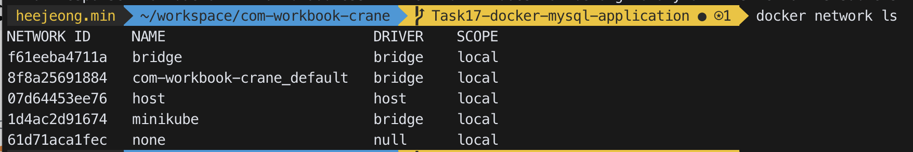
         
   2. minikube 네트워크의 subnet범위를 확인한다. 
   
            docker network inspect <network name>
   
   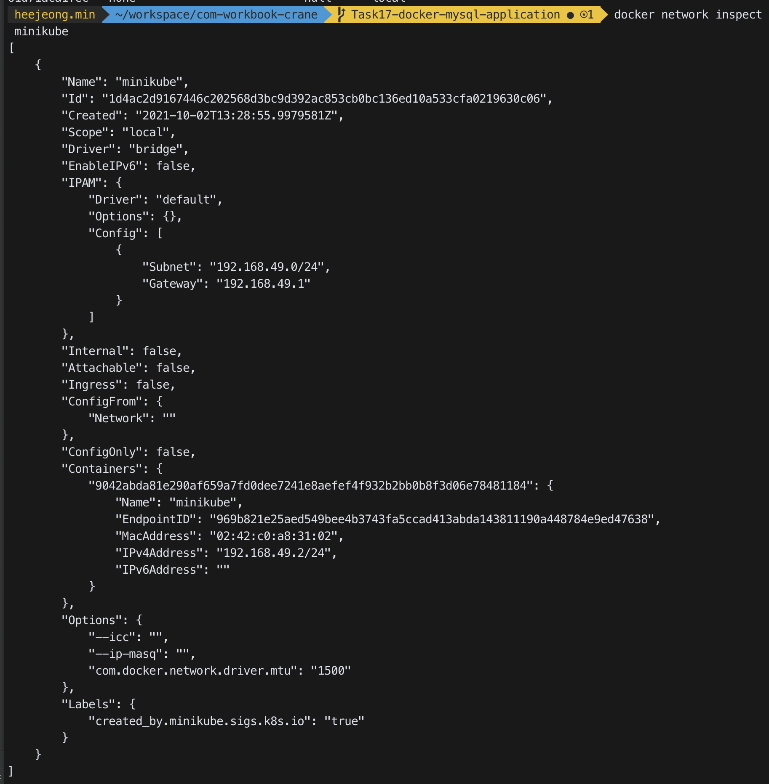
            
  
   3. 나의 crane-mysql 을 minkube 서브넷 범위에 포함시켜준다.   
   
            docker network connect <target> <container tobe connected> --ip=<any valid IP on the target network subent>
   
   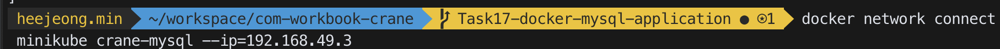

   4. 다시 pod 를 띄우니 pod 내 어플리케이션 까지 정상적으로 노출된다. 
                 
   - 파드  
       - 쿠버네티스는 개별 컨테이너를 직접 다루지 않는다. 대신 함께 배치된 다수의 컨테이너라는 개념을 사용하고, 이 컨테이너 그룹을 파드(Pod)라고 한다.
       - 파드는 하나 이상의 밀접하게 연관된 컨테이너의 그룹으로 같은 워커 노드에서 같은 리눅스 네임스페이스로 함께 실행된다. 
       - 각 파드는 자체 IP, 호스트 이름, 프로세스 등이 있는 논리적을 분리된 머신이며, 애플리케이션 프로세스를 실행하는 하나 이상의 컨테이너를 갖는다.
       - 파드에서 실행 중인 모든 컨테이너는 동일한 논리적인 머신에서 실행하는 것처럼 보이지만, 다른 파드에서 실행중인 컨테이너는 같은 워크노드에서 실행중이라도 다른 머신에서 실행중인 것으로 나타난다. 
       - 파드 라이프 사이클 https://kubernetes.io/docs/concepts/workloads/pods/pod-lifecycle/
          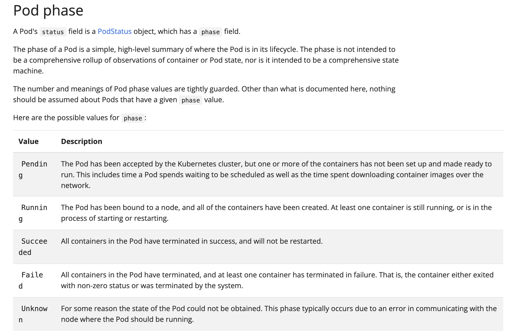

  - 위의 파드까지 띄우는 과정은 다음과 같다. 
        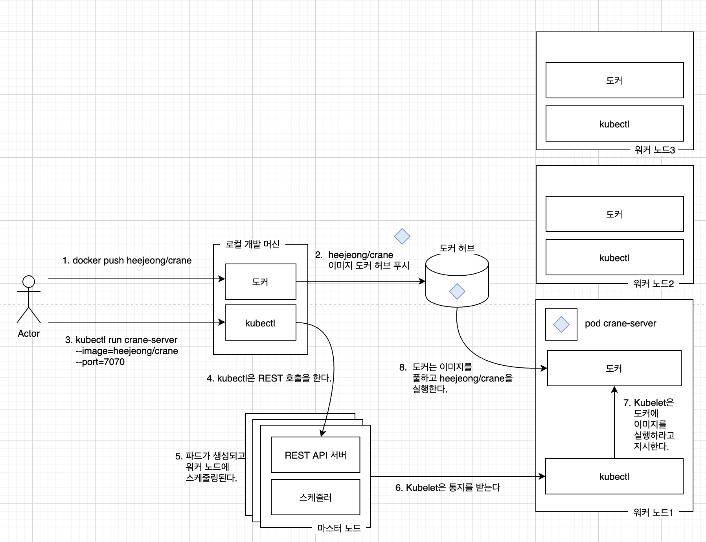
        
'4. 실행중인 파드에 어떻게 접근할 수 있을까?  
    - 각 파드는 자체 IP주소를 가지고 있지만 이 주소는 클러스터 내부에 있으며 외부에서 접근이 불가능하다. 
      외부에서 접근이 가능하게 하려면 서비스 오브젝트를 통해 노출해야 한다. 파드 뿐만 아니라 다른 서비스들도 마찬가지인데
      외부에 노출 시키기 위해서는 LoadBalancer 유형의 특별한 서비스를 생성해야 한다. 
    - LoadBalancer 유형의 서비스를 생성하면 외부 로드 밸런서가 생성되므로 로드 밸런서의 퍼블릭 IP를 통해 파드에 연결할 수 있다. 
    
   - 서비스 오브젝트 생성하기
   
            kubectl expose po crane --type=LoadBalancer --name crane-http
            
      - po는 pod를 의미하는 약어인데, 대부분의 리소스 유형은 약어를 가지고 있다고 한다.  
            - service : svc
            - replicationcontroller : rc
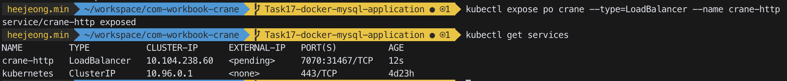  
   
   - 서비스 조회하기  
   
   
        kubectl get services  
   
   
   위의 스크린샷에서 외부 서비스 IP가 아직 pending인건 로드 밸런서를 생성하는데 시간이 걸리기 때문이라서 기다렸다 조회하면 생성된다고 한다. 
   단, minikube로 하는 경우 터널링을 켜주어야 external ip가 생성된다. 
    
        minikube tunnel     
    
  <<LoadBalancer를 생성하면서 만난 오류 : **Recv failure: Connection reset by peer**>>        
  
   - 처음 로드밸런서를 생성할때 포트를 따로 지정해 주지 않았는데, 그럼 pod 설정을 따라가는지 7070으로 생성되었다. 
     생성된 external-ip 로 접근시도하였지만 "Connection reset by peer" 메세지가 나왔다. 
     
   - 도움 받은 글 : https://github.com/kubernetes/minikube/issues/9482  
     로드밸런서의 포트를 8080으로 생성하지 않으면 이런 현상이 있다고 한다. 생성된 서비스를 "kubectl delete service crane-http" 명령어로 
     삭제하고 8080으로 다시 띄우니 파드내 어플리케이션 접속 성공  
     
                    
       kubectl expose po crane --type=LoadBalancer --port=8080 --name crane-http


- 파드와 컨테이너의 이해  
    - 시스템의 가장 중요한 구성 요소
    - 실습에서는 파드가 하나의 컨테이너를 가지고 있지만 보통 파드는 원하는 만큼의 컨테이너를 포함할 수 있다. 
    - 컨테이너 내부에는 crane 서비스의 프로세스가 있고, 포트 7070에 바인딩되어 요청을 기다리고 있다. 
    - 자체의 고유 사설 IP주소와 호스트 이름을 같는다. 

- 서비스가 필요한 이유
    - 서비스가 필요한 이유를 알려면 파드의 주요 특성을 알아야한다. 파드는 일시적이기 때문에 언제든지 사라질 수 있다.  
      새로운 파드는 다른 IP주소를 할당 받는다. 이렇게 파드의 IP가 변경되는 문제와, 여러개의 파드를 단일 IP와 포트의 쌍으로 
      연결하기 위해 서비스가 필요하다.   
    - 서비스는 어느 파드가 어디에 존재하는지, 어떤 IP를 갖는지 상관없이 파드 중 하나로 연결하여 요청을 처리한다. 
      서비스는 동일한 서비스를 제공하는 하나 이상의 파드 그룹의 정적 위치를 나타낸다. 
        
- 레플리케이션 컨트롤러 역할의 이해 
    - 위의 실습처럼 생성하면 replication controller가 생성되는 것이 아니라 바로 pod가 생성된다. 
      replication controller를 생성하려면 yml 혹은 json 파일을 만들어야 한다. 
      
    1. json 파일 (파일명은 내가 임의로 replication-controller.json으로 생성하였다.)  
    (https://jamesdefabia.github.io/docs/user-guide/replication-controller/operations/)  
    
        ```$json
        {
          "kind": "ReplicationController",
          "apiVersion": "v1",
          "metadata": {
            "name": "crane-controller"
          },
          "spec": {
            "replicas": 1,
            "template": {
              "metadata": {
                "lables": {
                  "app": "crane"
                }
              },
              "spec": {
                "volumes": null,
                "containers": [
                  {
                    "name": "crane",
                    "image": "heejeong/crane",
                    "imagePullPolicy": "Always",
                    "ports": [
                      {
                        "containerPort": 7070
                      }
                    ]
                  }
                ]
              }
            }
          }
        }        
        ``` 
        
    2. kubernetes에게 json 파일을 전달하여 replication controller를 생성한다.  
    
        ``` 
         kubectl create -f replication-controller.json
        ``` 
            
        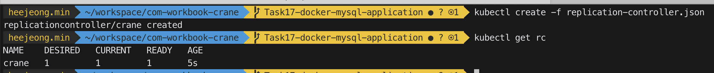 

    3. replication controller가 생성되었는지 확인한다.  
        - rc는 replication controller의 약자
        - 생성된 replication controller는 metadata.name에서 정의한 이름을 따라간다.
            ``` 
             kubectl get rc  
            ```             
    4. replication controller가 관리하는 파드는 자동으로 생성된다.  
        이름은 metadata.name을 따라가지만 식별 '-' 후 다섯자리가 더 붙는다자.
         ``` 
          kubectl get pods  
         ```
        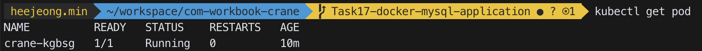 
 
    5. 이제 replication controller에 대해서 loadbalancer를 생성한다. (minikube tunnel 도 열기)
        
        ``` 
          minikube tunnel
       
          kubectl expose rc crane --type=LoadBalancer --name crane-http  
        ```
   
   - 구성과 레플리케이션 컨트롤러의 역할
      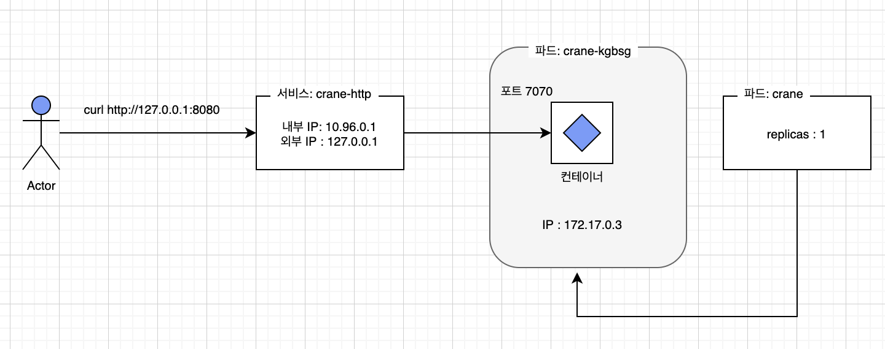 
            - 항상 정확히 하나의 파드 인스턴스를 실행하도록 지정되어 있기 때문에 (replication-controller.json) 
              파드를 강제로 삭제하면 다시 자동으로 하나 더 만든다. 즉, 파드를 복제하고 항상 실행 상태로 만드는 역학을 한다. 
              
  
  - 애플리케이션 수평 확장
    - 쿠버네티스를 사용하는 주요 이점 중 하나는 간단하게 배포를 확장할 수 있따는 점이다. 다음은 실행중인 인스턴스를 세개로 증가시키는 것이다. 
      ```
        kubectl get rc
      ```   
  
      DESIRED : 레플리케이션 컨트롤러가 유지해야하는 파드의 개수
      CURRENT : 현재 실행 중인 파드의 개수
  
  - 의도하는 레플리카 수 늘리기 
    - 파드의 레클리카 수를 늘리려면 레플리카 컨트롤러에서 의도하는 레플리카 수를 변경해야 한다. (DESIRED 값 변경)
     ```
       kubectl scale rc crane --replicas=3
     ```
    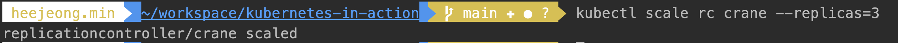 
    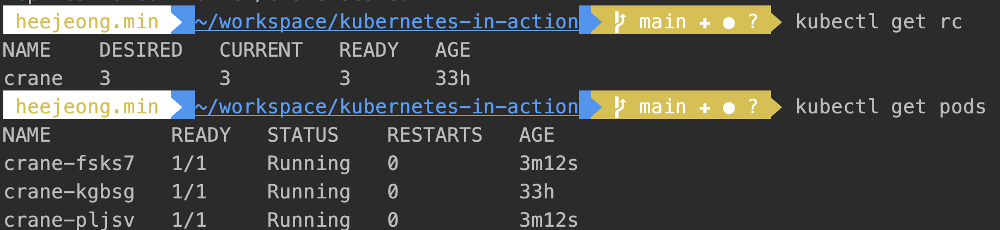 
    - 쿠버네티스에게 파드 세개를 항상 유지 해야한다는 것을 알려준다. 어떻게 변경해야하는 지는 알려주지 않는데, 이것이 쿠버네티스의 
      기본 원칙 중 하나이다. 쿠버네티스가 어떤 액션을 수행해야하는지 정확하게 알려주는 대신 시스템의 의도하는 상태 (desired state)를 
      선언적으로 변경하면 쿠버네티스가 실제 현재 상태를 (current state)를 검사해 의도한 상태로 조정한다. (reconcile)
  
  - 서비스 호출 시 모든 파드가 요청을 받는지 확인
    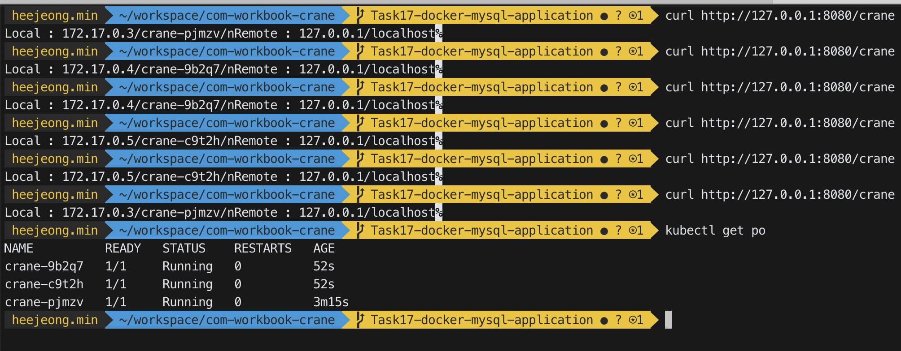 
     
      - 요청을 보낼때 마다 다른 pod에서 요청이 처리되는데, 하나 이상의 파드가 서비스 뒤에 존재할때 서비스가 로드밸런서 역할을 한다. 
      
  - 애플리케이션이 실행중인 노드 검사하기 
    - 어떤 노드에 파드가 실행중인지 중요하지 않지만 어떤 노드에 스케줄링이 되었는지 궁금할 수 있다. 
    - 파드가 스케줄링된 노드와 상관없이 컨테이너 내부에 실행 중인 모든 애플리케이션은 동일한 유형의 운영체제 환경을 갖는다. 
    - 각 파드는 요청된 만큼의 컴퓨팅 리소스를 제공받는다. 
    - 파드를 조회할 때 파드 IP와 실행중인 노드 표시하기
      ```
        kubectl get pods -o wide
      ```      
    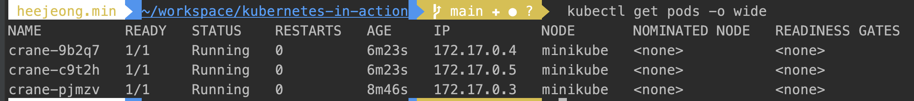 
      
      - 파드 세부 정보 살펴보기
        ```
          kubectl describe pod crane-9b2q7
        ```         

    ```
        Name:         crane-9b2q7
        Namespace:    default
        Priority:     0
        Node:         minikube/192.168.49.2
        Start Time:   Mon, 04 Oct 2021 21:21:49 +0900
        Labels:       app=crane
        Annotations:  <none>
        Status:       Running
        IP:           172.17.0.4
        IPs:
          IP:           172.17.0.4
        Controlled By:  ReplicationController/crane
        Containers:
          crane:
            Container ID:   docker://4068e2e21db3ee048aa9f1c18e2e3f6067a2523e06f0bfd995dcc94896891323
            Image:          heejeong/crane
            Image ID:       docker-pullable://heejeong/crane@sha256:90536c360799a5097b84f685fa7bbb9d837e658cb54404684abd1143bbd0deca
            Port:           7070/TCP
            Host Port:      0/TCP
            State:          Running
              Started:      Mon, 04 Oct 2021 21:21:56 +0900
            Ready:          True
            Restart Count:  0
            Environment:    <none>
            Mounts:
              /var/run/secrets/kubernetes.io/serviceaccount from kube-api-access-hdfrp (ro)
        Conditions:
          Type              Status
          Initialized       True 
          Ready             True 
          ContainersReady   True 
          PodScheduled      True 
        Volumes:
          kube-api-access-hdfrp:
            Type:                    Projected (a volume that contains injected data from multiple sources)
            TokenExpirationSeconds:  3607
            ConfigMapName:           kube-root-ca.crt
            ConfigMapOptional:       <nil>
            DownwardAPI:             true
        QoS Class:                   BestEffort
        Node-Selectors:              <none>
        Tolerations:                 node.kubernetes.io/not-ready:NoExecute op=Exists for 300s
                                     node.kubernetes.io/unreachable:NoExecute op=Exists for 300s
        Events:
          Type    Reason     Age    From               Message
          ----    ------     ----   ----               -------
          Normal  Scheduled  7m11s  default-scheduler  Successfully assigned default/crane-9b2q7 to minikube
          Normal  Pulling    7m10s  kubelet            Pulling image "heejeong/crane"
          Normal  Pulled     7m5s   kubelet            Successfully pulled image "heejeong/crane" in 5.117939s
          Normal  Created    7m5s   kubelet            Created container crane
          Normal  Started    7m4s   kubelet            Started container crane
    ```

- 미니쿠베 대시보드
  ```
    minkube dashboard
  ```    
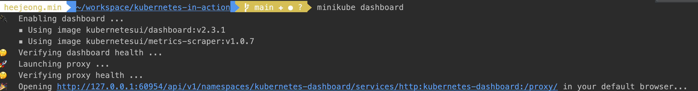 
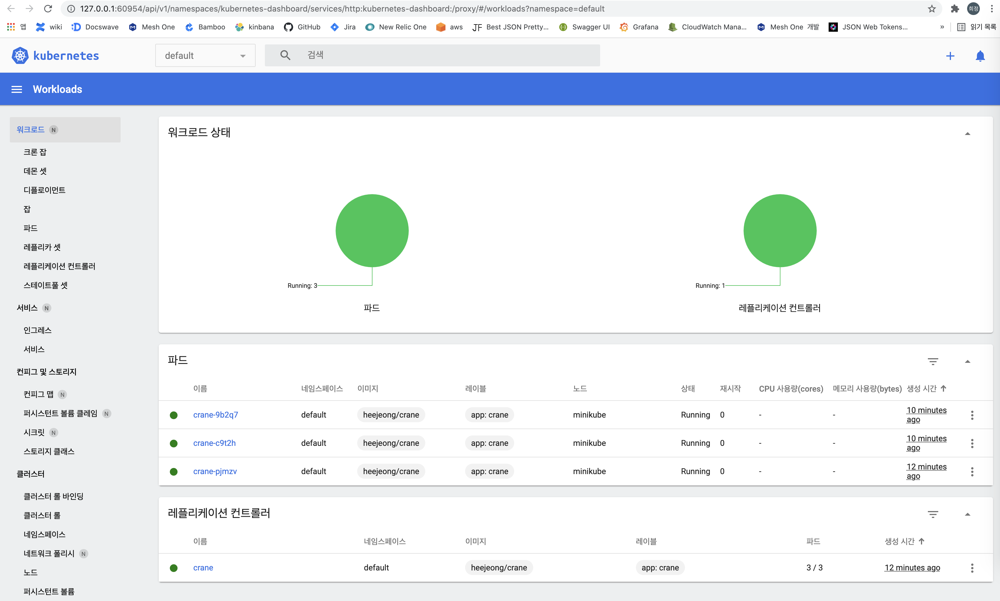 
   