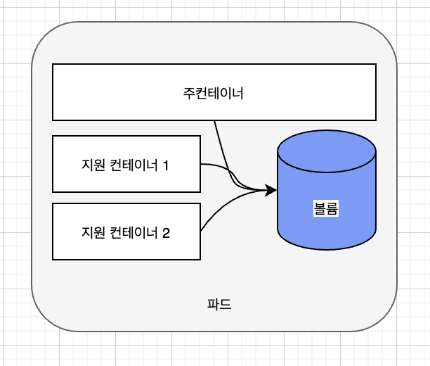
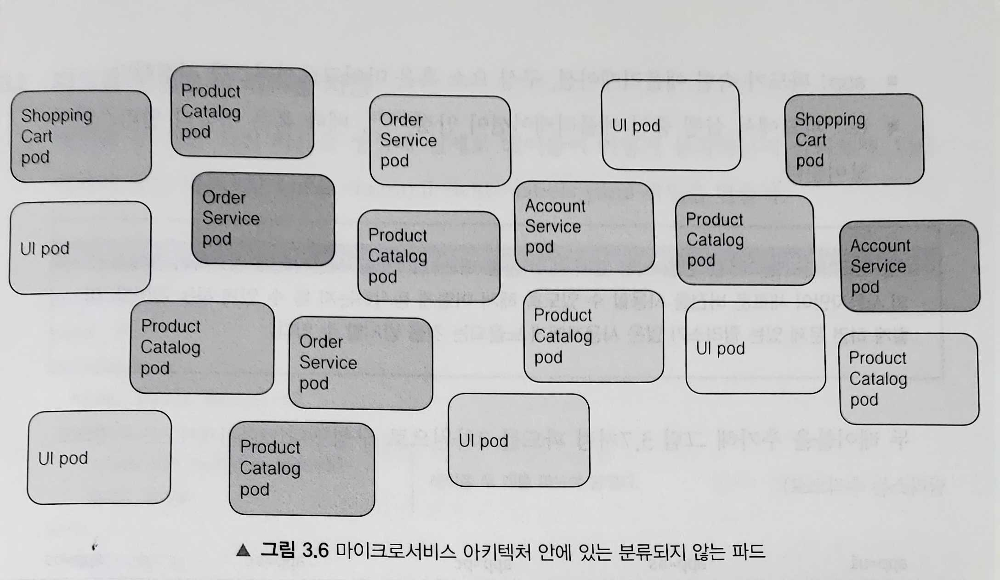
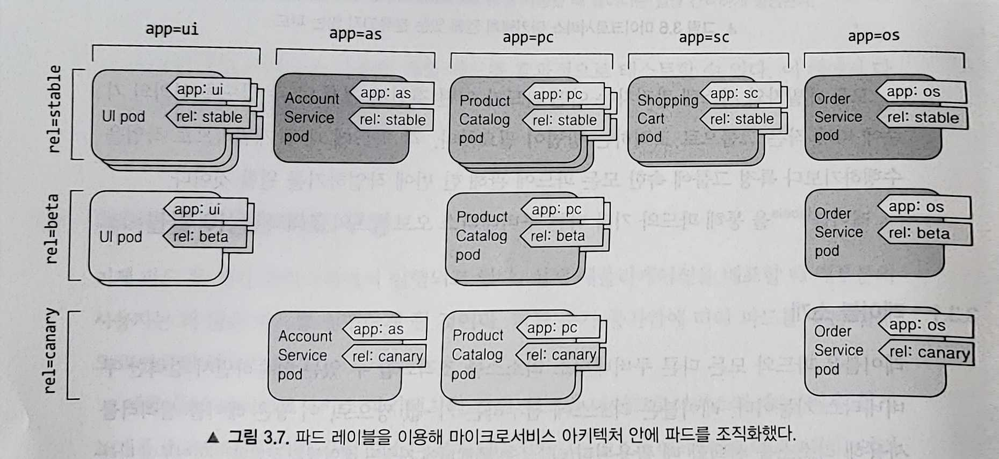

Chapter3. 파드: 쿠버네티스에서 컨테이너 실행
---

컨테이너는 단일 프로세스를 실행하는 목적을 설계되었다. (프로세스가 자기 자신의 자식 프로세스 생성하는 것 제외)
여러 프로세스를 단일 컨테이너로 묶지 않기 때문에, 컨테이너를 함께 묶고 하나의 단위로 관리할 수 있는 또 다른 상위 구조가 필요하고, 
그게 파드이다.  
컨테이너 모음을 사용 밀접하게 연관된 프로세스를 함께 실행하고 단일 컨테이너 안에서 모두 함께 실행되는 것 처럼 (거의)
동일한 환경을 제공할 수 있으면서도 이들을 격리된 상태로 유지 할 수 있다. 해

### 같은 파드에서 컨테이너 간 부분 격리  
   - 단일 컨테이너를 격리하는 것이 아닌, 컨테이너 그룹을 분리하려면 어떻게 해야할까?  
        - 그룹 안에 있는 컨테이너들은 특정한 리소스를 공유하기 때문에 그룹내의 컨테이너들은 완벽하게 격리되어서는 안된다. 
        - 단, 파일시스템은 컨테이너 이미지에서 나오기 때문에 컨테이너끼리 분리된다. 쿠버네티스 볼륨 개념을 사용하면 파일 디렉터리를 공유하는것도 가능은 하다. 
        - 쿠버네티스 파드 안에 있는 모든 컨테이너가 자체 네임스페이스가 아닌 동일한 리눅스 네임스페이스를 공유하도록 도커를 설정한다.  
          파드의 모든 컨테이너는 동일한 네트워크 네임스페이스와 UTS 네임스페이스 안에서 실행되기 때문에, 모든 컨테이너는 같은 호스트 이름과
          네트워크 인터페이스를 공유한다. (UTS : UNIX Timesharing System Namespace를 뜻하며 호스트 이름을 네임스페이스별로 격리한다.)  
        - 비슷하게 파드의 모든 컨테이너들은 동일한 IPC 네임스페이스 아래에서 실행돼 IPC를 통해 서로 통신할 수 있다. (프로세스 간 통신(Inter-Process Communication, IPC)) 
  
- 컨테이너가 동일한 IP와 포트 공간을 공유하는 방법
    - 파드 안의 컨테이너가 동일한 네트워크 네임스페이스에서 실행된다는 것은, 동일한 IP 주소와 포트 공간을 공유한다는 것이다.  
      이때, 동일한 파드 안에 컨테이너에서 실행중인 프로세스가 같은 포트 번호를 사용하지 않도록 주의해야한다.  
      파드 안에 있는 모든 컨테이너는 동일한 루프백 인터페이스를 갖기 때문에 컨테이너들이 로컬 호스트를 통해 서로 통신할 수 있다.
      
      - 파드간 플랫 네트워크  
        쿠버네티스 클러스터의 모든 파드는 하나의 플랫한 공유 네트워크 주소 공간에 상주함으로 모든 파드는 다른 파드의 IP 주소를 사용해 접근하는 것이 가능하며, 
        NAT(Network Address Translation)은 존재하지 않는다. 두 파드가 서로 네트워크 패킷을 보내면, 상대방의 실제 IP 주소를 패킷 안에 있는 출발지 IP주소에서 찾을 수 있다.
        파드가 어느 노드에 존재하는지도 중요하지 않다.  
        
        
        
- 파드에서 컨테이너의 적절한 구성  
  - 한 호스트에 모든 유형의 애플리케이션을 넣었던 이전과 달리 파드는 특정한 애플리케이션만을 호스팅한다. 모든 것을 하나에 넣는 대신에 
    애플리케이션을 여러 파드로 구성하고, 각 파드에는 밀접하게 관련이 있는 구성 요소나 프로세스만 포함한다.  
    - 다계층 애플리케이션을 여러 파드로 분할할 수 있다. 쉽게 웹서버와 데이터베이스가 같은 머신에서 실행되지 않는 것이 맞음으로 서로 다른 파드에 넣는 것이 맞다.
    - 개별 확장이 가능하도록 여러 파드로 분할 해야한다. 이렇게 두 컨테이너를 하나의 파드에 넣지 말아야 하는 또 다른 이유는 스케일링 때문이다.  
      쿠버네티스는 개별 컨테이너를 수평으로 확장할 수 있기 때문에 전체 파드를 수평으로 확장한다. 만일 웹서버와 데이터베이스 컨테이너가 같은 파드에 존재한다면 
      스케일링 시 모두 두개씩 생기게 된다. 
    - 파드에서 여러 컨테이너를 사용하는 경우는 어떤 경우일까? 주로 애플리케이션이 하나의 주요 프로세스와 하나 이상의 보완 프로세스로 구성되는 경우이다.  
      예를 들어, 파일을 제공하는 웹서버가 주 컨테이너일때, 추가 컨테이너는 외부에서 주기적으로 콘텐츠를 받아 웹서버 디렉터리에 저장을 하거나, 로그 데이터 수집기, 데이터 프로세서 등이 있을 수 있다. 
       
      

        이렇게 구성하기 전에 생각해 볼 점은 다음과 같다.   
            - 컨테이너를 함께 실행해야 하는가, 혹은 서로 다른 호스트에서 실행할 수 있을까?  
            - 여러 컨테이너가 모여 하나의 구성요소를 나타내는가, 혹은 개별적인 구성요소인가?  
            - 컨테이너가 함께, 혹은 개별적으로 스케일링 되어야 하는가?  

 
### YML 또는 JSON 디스크립터로 파드 생성  
파드를 포함한 다른 쿠버네티스 리소스는 일반적으로 쿠버네티스 REST API 엔드포인트에 JSON 혹은 YAML 매니페스트를 전송하여 생성한다. 
kubectl run 명령어로 리소스를 만들 수  있지만 제한된 속정 집합만 설정할 수 있다.  
매니페스트를 사용하면 모든 쿠버네티스 오브젝트를 정의하여 버전 관리 시스템에 넣는 것이 가능해진다.   

이전 장 실습을 위해 나는 json을 디스크립터를 만들었지만 다음 명령어를 사용하면 yaml로 된 정의를 볼수 있다. 
파드의 이름을 명시하지않으면 파드의 전체 정의를 확인할 수 있다. 
```
    kubectl get po crane-pjmzv -o yaml  
    kubectl get po -o json 
```
- apiVersion : 이 YAML 디스크립터에서 사용한 쿠버네티스 API버전   
- kind : 쿠버네티스 오브젝트/리소스 유형  
- metatdata : 파드의 메타데이터(이름, 레이블, 어노테이션 등)  
- spec : 파드 정의/내용 (파드 컨테이너 목록, 볼륨 등)  
- status : 파드와 그 안의 여러 컨테이너의 상세한 상태. 

```$yaml
apiVersion: v1
kind: Pod
metadata:
  creationTimestamp: "2021-10-04T12:19:26Z"
  generateName: crane-
  labels:
    app: crane
  managedFields:
  - apiVersion: v1
    fieldsType: FieldsV1
    fieldsV1:
      f:metadata:
        f:generateName: {}
        f:labels:
          .: {}
          f:app: {}
        f:ownerReferences:
          .: {}
          k:{"uid":"4f2ed207-4c21-446a-9265-c942ddcd53c8"}: {}
      f:spec:
        f:containers:
          k:{"name":"crane"}:
            .: {}
            f:image: {}
            f:imagePullPolicy: {}
            f:name: {}
            f:ports:
              .: {}
              k:{"containerPort":7070,"protocol":"TCP"}:
                .: {}
                f:containerPort: {}
                f:protocol: {}
            f:resources: {}
            f:terminationMessagePath: {}
            f:terminationMessagePolicy: {}
        f:dnsPolicy: {}
        f:enableServiceLinks: {}
        f:restartPolicy: {}
        f:schedulerName: {}
        f:securityContext: {}
        f:terminationGracePeriodSeconds: {}
    manager: kube-controller-manager
    operation: Update
    time: "2021-10-04T12:19:26Z"
  - apiVersion: v1
    fieldsType: FieldsV1
    fieldsV1:
      f:status:
        f:conditions:
          k:{"type":"ContainersReady"}:
            .: {}
            f:lastProbeTime: {}
            f:lastTransitionTime: {}
            f:status: {}
            f:type: {}
          k:{"type":"Initialized"}:
            .: {}
            f:lastProbeTime: {}
            f:lastTransitionTime: {}
            f:status: {}
            f:type: {}
          k:{"type":"Ready"}:
            .: {}
            f:lastProbeTime: {}
            f:lastTransitionTime: {}
            f:status: {}
            f:type: {}
        f:containerStatuses: {}
        f:hostIP: {}
        f:phase: {}
        f:podIP: {}
        f:podIPs:
          .: {}
          k:{"ip":"172.17.0.3"}:
            .: {}
            f:ip: {}
        f:startTime: {}
    manager: kubelet
    operation: Update
    subresource: status
    time: "2021-10-04T12:19:30Z"
  name: crane-pjmzv
  namespace: default
  ownerReferences:
  - apiVersion: v1
    blockOwnerDeletion: true
    controller: true
    kind: ReplicationController
    name: crane
    uid: 4f2ed207-4c21-446a-9265-c942ddcd53c8
  resourceVersion: "48901"
  uid: a03b9fea-f54f-41b6-8311-34314c83c8cf
spec:
  containers:
  - image: heejeong/crane
    imagePullPolicy: Always
    name: crane
    ports:
    - containerPort: 7070
      protocol: TCP
    resources: {}
    terminationMessagePath: /dev/termination-log
    terminationMessagePolicy: File
    volumeMounts:
    - mountPath: /var/run/secrets/kubernetes.io/serviceaccount
      name: kube-api-access-nw9l8
      readOnly: true
  dnsPolicy: ClusterFirst
  enableServiceLinks: true
  nodeName: minikube
  preemptionPolicy: PreemptLowerPriority
  priority: 0
  restartPolicy: Always
  schedulerName: default-scheduler
  securityContext: {}
  serviceAccount: default
  serviceAccountName: default
  terminationGracePeriodSeconds: 30
  tolerations:
  - effect: NoExecute
    key: node.kubernetes.io/not-ready
    operator: Exists
    tolerationSeconds: 300
  - effect: NoExecute
    key: node.kubernetes.io/unreachable
    operator: Exists
    tolerationSeconds: 300
  volumes:
  - name: kube-api-access-nw9l8
    projected:
      defaultMode: 420
      sources:
      - serviceAccountToken:
          expirationSeconds: 3607
          path: token
      - configMap:
          items:
          - key: ca.crt
            path: ca.crt
          name: kube-root-ca.crt
      - downwardAPI:
          items:
          - fieldRef:
              apiVersion: v1
              fieldPath: metadata.namespace
            path: namespace
status:
  conditions:
  - lastProbeTime: null
    lastTransitionTime: "2021-10-04T12:19:26Z"
    status: "True"
    type: Initialized
  - lastProbeTime: null
    lastTransitionTime: "2021-10-04T12:19:30Z"
    status: "True"
    type: Ready
  - lastProbeTime: null
    lastTransitionTime: "2021-10-04T12:19:30Z"
    status: "True"
    type: ContainersReady
  - lastProbeTime: null
    lastTransitionTime: "2021-10-04T12:19:26Z"
    status: "True"
    type: PodScheduled
  containerStatuses:
  - containerID: docker://44587cb82c35dc6799e24c16ce8d7e1a89299c85204d555dde78d54602bcd0c2
    image: heejeong/crane:latest
    imageID: docker-pullable://heejeong/crane@sha256:90536c360799a5097b84f685fa7bbb9d837e658cb54404684abd1143bbd0deca
    lastState: {}
    name: crane
    ready: true
    restartCount: 0
    started: true
    state:
      running:
        startedAt: "2021-10-04T12:19:29Z"
  hostIP: 192.168.49.2
  phase: Running
  podIP: 172.17.0.3
  podIPs:
  - ip: 172.17.0.3
  qosClass: BestEffort
  startTime: "2021-10-04T12:19:26Z"

```

복잡해보이지만 파드를 만들기 위해 작성할때 모든 것을 기재하지는 않는다. 
실습에 사용된 파드를 만들기 위해 사용하였던 json 형태의 디스크립터를 보면 다음과 같다.  
이전 실습에서 replicationcontroller를 사용하였기 때문에 이 기준으로 우선 본다. 

metadata.name : replication controller의 이름. 만일 kind 가 pod 였다면 pod의 이름이 된다. 
spec.spec.containers[index].image : 컨테이너를 만드는 컨테이너 이미지  
spec.spec.containers[index].ports : 애플리케이션이 수신하는 포트
```$json
{
  "kind": "ReplicationController",
  "apiVersion": "v1",
  "metadata": {
    "name": "crane"
  },
  "spec": {
    "replicas": 1,
    "template": {
      "metadata": {
        "labels": {
          "app": "crane"
        }
      },
      "spec": {
        "volumes": null,
        "containers": [
          {
            "name": "crane",
            "image": "heejeong/crane",
            "imagePullPolicy": "Always",
            "ports": [
              {
                "containerPort": 7070
              }
            ]
          }
        ]
      }
    }
  }
}
```

작성 시 reference 문서를 참고할 수도 있지만, 다음 명령어를 사용하면 개별 API 오브젝트에 지원되는 속성을 확인할 수 있다. 
```
    kubectl explain pods
```
```
KIND:     Pod
VERSION:  v1

DESCRIPTION:
     Pod is a collection of containers that can run on a host. This resource is
     created by clients and scheduled onto hosts.

FIELDS:
   apiVersion   <string>
     APIVersion defines the versioned schema of this representation of an
     object. Servers should convert recognized schemas to the latest internal
     value, and may reject unrecognized values. More info:
     https://git.k8s.io/community/contributors/devel/sig-architecture/api-conventions.md#resources

   kind <string>
     Kind is a string value representing the REST resource this object
     represents. Servers may infer this from the endpoint the client submits
     requests to. Cannot be updated. In CamelCase. More info:
     https://git.k8s.io/community/contributors/devel/sig-architecture/api-conventions.md#types-kinds

   metadata     <Object>
     Standard object's metadata. More info:
     https://git.k8s.io/community/contributors/devel/sig-architecture/api-conventions.md#metadata

   spec <Object>
     Specification of the desired behavior of the pod. More info:
     https://git.k8s.io/community/contributors/devel/sig-architecture/api-conventions.md#spec-and-status

   status       <Object>
     Most recently observed status of the pod. This data may not be up to date.
     Populated by the system. Read-only. More info:
     https://git.k8s.io/community/contributors/devel/sig-architecture/api-conventions.md#spec-and-status

```

- 컨테이너 이름을 지정해 다중 컨테이너 파드에서 로그 가져오기
    - 여러 컨테이너를 포함한 파드인 경우, 컨테이너 이름을 kubectl logs 명령에 -c <컨테이너 이름> 옵션을 명시적으로 포함해야한다. 
      나의 예제에서는 replication controller를 사용하였기 때문에 replication controller의 이름을 -c 다음에 넣어주어야 출력되는 것을 볼 수 있다. 
      
    ```
        kubectl logs crane-pjmzv -c crane

    ```
    
    - 컨테이너 로그는 하루 단위로 로그파일이 10MB 크기에 도달할 때마다 순환된다. kubectl logs명령은 마지막으로 순환된 로그 항목만 보여준다.  
    - 파드가 삭제되는 경우 로그도 함께 사라진다. 삭제된 후에도 로그를 보존해야한다면, 모든 로그를 중앙 저장소에 저장하는 클러스터 전체의 중앙집중식 로깅을 해야한다.
    

### 파드에 요청보내기
앞 장에서는 서비스를 만들어 접속하였는데, 이번 장에서는 파드에 테스트와 디버깅 목적으로 포드 포워딩을 통해 접속하는 방법을 알아본다. 

- 로컬 네트워크 포트를 파드의 포트로 포워딩 
    - 서비스를 거치지 않고 특정 파드에 접근하고 싶을때 해당 파드에 접근할 수 있는 포트 포워딩을 구성할 수 있다. 
      ```
        kubectl port-forward crane-pjmzv 8888:8080
      ```
      
      
      

      


### 레이블을 이용한 파드 구성
실제 애플리케이션을 배포할때 대부분 더 많은 파드를 실행하게 된다. 파드 수가 증가하게 되면, 파드를 부분 집합으로 분류하여 관리할 필요가있다.  
예를 들어 마이크로서비스 아키텍쳐의 경우 배포된 마이크로서비스의 수는 매우 쉽게 20개를 초과한다. 이런 구성요소들이 여러 버전 혹은 릴리즈가 동시에 실행되면 
시스템에 수백개의 파드가 생길 수 있다.  
레이블을 사용하면 특정 그룹에 속한 모든 파드에 관해 한번에 작업할 수 있게 오브젝트의 조직화가 필요하다. 

- 레이블
    - 레이블은 파드와 다른 모든 쿠버네티스 리소스를 조직화 할 수 있는 단순하면서 강력한 쿠버네티스 기능이다. 
    - 리소스에 첨부할 수 있는 키-값 쌍으로, 이 쌍은 레이블 셀렉터를 사용해 리소를 선택할 때 사용된다. 
    - 일반적으로 리소스를 생성할 때 레이블을 붙이지만 나중에 레이블을 추가하거나 기존 레이블 값을 수정할 수도 있다.  
        - app : 파드가 속한 애플리케이션, 구성 요소 혹은 마이크로서비스
        - rel : 파드에서 실행중인 애플리케이션의 릴리즈 버전 
        
       | 레이블의 개념이 없는 파드들 | 파드를 레이블로 조직적 관리 |
       | :-------------- | :----------- |
       |  |  | 
       
    - 파드를 생성할 때 레이블 지정하는 방법과 레이블 확인방법
        - metadata.labels에 키-밸류로 적어주면 된다.  
          label을 포함하여 리소스를 검색하고 싶을때에는 --show-lables 옵션을 사용하면 되며, 
          그중 원하는 label만 컬럼화화여 보고 싶으면 -L 옵션을 사용하면 된다.  
    ```yaml
      apiVersion: v1
      kind: Pod
      metadata:
          name: kubia-manual-v2
          lables:
              created_method: manual
              env: prod
      sepc:
          containers:
              -image: luksa/kubia
               name: kubia
               ports:
               - containerPort: 8080
                 protocol: TCP
    ```
    ```
        kubectl get po --show-labels
        kubectl get po -L created_method,env
    ```
    
      
    - 기존 파드 레이블 수정
        - 새로 레이블을 추가할때와 기존의 레이블을 수정할대의 다른 점은 후자는 --overwrite 옵션이 붙어야한다. 
     ```
        kubectl labels po crane-pjmzv env=local
        kubectl labels po crane-pjmzv env=debug --overwrite
     ```
     
     
     
   - 레이블 셀렉터를 이용한 부분 집합 나열  
     레이블 셀렉터는 특정 레이블로 태그된 파드의 부분 집합을 선택해 원하는 작업을 수행할 수 있게 해주며, 리소스를 필터링해주는 기준이된다.  
     레이블 셀렉터는 리소스 중에서 다음 기준에 따라 리소스를 선택한다.
        - 특정한 키를 포함하거나 포함하지 않는 테이블
        - 특정한 키와 값을 가진 레이블
        - 특정한 키를 갖고 있지만 다른 값을 가진 레이블  
        
     레이블 셀렉터를 사용해 파드 나열
        - 대문자 L 옵션은 키를 컬럼화하여 조회해 주지만, 소문자 l 옵션은 명시한 키/밸류 값을 가진 파드만을 조회할 수 있다. 
     ```
        kubectl get pods -l created_method=manual
     ```
     
     
        - env 레이블을 가지고 있지만 값은 무엇이든 상관없는 파드를 보려면 다음과 같이 키만 명시한다.  
          반대로 특정 키를 가지고 있지 않은 파드를 필터하고 싶을때는 '!키' 형태로 조회할 수 있다.
     ```
        kubectl get po -l env
     ```
     
        - 더 많은 조건들 
            - created_method!=manual
            - env in (prod, debug)
            - env notin (prod, debug)
            - app=crane,env=debug
            
   - 레이블 셀렉터를 이용한 파드 스케줄링 제한  
     쿠버네티스에게 파드를 어느 노드에 스케줄링할지 알려줄 필요가 없지만, 컨트롤 해야하는 상황이 있다고 하다.  
     예를 들어, 노드의 하드웨어 인프라가 동일하지 않은 경우 일 수 있는데 워크 노드의 일부는 HDD를 가지고 있고, 나머지는 SSD를 가지고 있는 경우,
     특정 파드를 한 그룹에 나머지 파드는 나머지 그룹에 스케줄링 되도록 할 수 있다.  
     쿠버네티스의 전체적인 아이디어는 그 위에 실행되는 애플리케이션으로 부터 실제 인프라스트럭쳐를 숨기는데 있다. 구체적으로 어떤 노드에 스케줄링되어야하는지 
     지정하게 되면 애플리케이션과 인프라스트럭쳐가 결합되기 때문이다. 정확한 노드를 지정하는대신, 노드의 요구사항을 기술하고 쿠버네티스가 선택할 수 있도록 해야한다. 
     
     - 워커 노드 분류에 레이블 사용  
       일반적으로 ops팀에서는 새 노드를 클러스터에 추가할 때 노드가 제공하는 하드웨어나 파드를 스케줄링 할 때 유용하게 사용할 수 있는 기타 사항을 레이블로 지정해 노드를 분류한다. 
       
     
     

     - 특정 노드에 파드 스케줄링  
       - spec 섹션 안에 nodeSelector필드를 추가한다. 파드를 생성할 때 스케줄러는 gpu=true 레이블을 가진 노드 중에 선택한다.  
       - 파드를 특정 노드에 스케줄링하는 것도 가능한데, 노드의 실제 호스트 이름을 지정한 경우이다. 다만 이런 경우 노드가 오프라인경우 스케줄링이 안될 수 있어 지양한다.
     ```
     apiVersion: v1
     kind: Pod
     metadata:
         name: kubia-gpu
         labels:
             created_method: manual
             env: prod
     spec:
         nodeSelector:
           gpu: "true"
         containers:
         - image: luksa/kubia
           name: kubia
           ports:
           - containerPort: 8080
             protocol: TCP
     ```
     
### 파드에 어노테이션 달기
어노테이션은 키-값 쌍으로 레이블과 거의 비슷하지만 식별 정보를 가지지 않는다.  
레이블은 오브젝트를 그룹화 하는데 사용할 수 있지만 어노테이션의 용도는 많은 정보를 보유하는데에 있다.  
어노테이션은 흔히 쿠버네트스에 새로운 기능이 추가될 때 흔히 사용이 되는데, 일반적으로 새로운 기능의 알파 혹은 베타 버전의 API 오브젝트에 새로운 필드를 바로 도입하지 않는다.
필드 대신 어노테이션을 사용하고, 필요한 API 변경이 명확해 지면 새로운 필드가 도입된다.  
어플리케이션 개발자에게 어노테이션이 유용하게 사용되는 경우는 파드나 다른 API 오브젝트에 설명을 추가해둘 때 이다. 

   
- 어노테이션 추가 및 수정  
  레이블을 만들 때와 같은 방법으로 파드를 생성할 때 어노테이션을 추가하는 것도 간으하고, 이미 존재하는 파드에 어노테이션을 추가하거나 수정하는 것도 가능하다. 
  - 어노테이션 추가 : 어노테이션은 고유 접두사를 시작으로 하는 것이 좋은데 (heejeong.min) 그렇지 않을 경우 다른 도구나 라이브러리가 오브젝트에 어노테이션을 추가하면서 기존에 있는 어노테이션을 덮어씌울 수 있기 때문이다.
  ```
    kubectl annotate po kubia-manual-v2 heejeong.min/addAnnotation="first annot"
  ```
  
