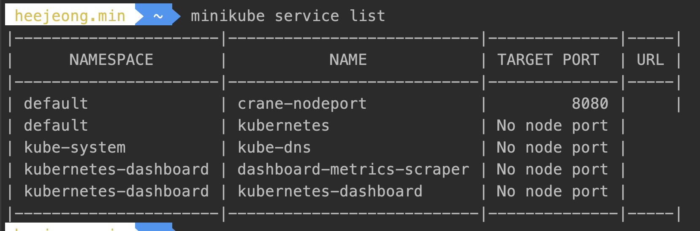

Chapter5. 서비스: 클라이언트가 파드를 검색하고 통신을 가능하게 함
---

파드가 다른 파드에게 제공하는 서비스를 사용하려면 다른 파드를 찾는 방법이 필요하다.
 - 쿠버네티스 이전엔 시스템 관리자가 클라이언트 구성 파일에 서비스를 제공하는 서버의 정확한 IP 주소나 호스트 이름을 지정
 - 쿠버네티스에서는 다음과 같은 이유로 그 동안의 방식을 사용할 수 없다. 
    1. 파드는 일시적. (노드에서 제거되거나, 장애로 다른노드로 언제든지 이동)
    2. 노드에 파드를 스케줄링한 후 파드가 시작되기 바로 전에 파드의 IP주소를 할당하기 때문에 미리 알 수 없다.
    3. 수평 스케일링은 여러 파드가 동일한 서비스를 제공 할 수 있고, 각 파드는 고유의 IP 주소가 있지만 클라이언트는 파드의 수, IP주소를 상관하지 않아야한다.
    
    
### 서비스
동일한 서비스를 제공하는 파드 그룹에 지속적인 단일 접점을 만들려고 할때 생성하는 리소스이다.


- 웹 서버가 하나든 수백 개든 상관없이 외부 클라이언트는 프론트엔드 파드에 연결 할 수 있어야한다.
    - 프론트엔드 파드에 관한 서비스를 만들고 클러스터 외부에서 액세스할 수 있도록 구성하면 외부 클라이언트가 파드에 연결할 수 있는 하나의 고정 IP가 노출된다.
- 프론트엔드 파드는 백엔드 데이터베이스에 연결해야 한다. 
    - 마찬가지로 백엔드 파드에 관한 서비스를 생성해 안정적인 주소를 만들어 파드의 IP주소가 변경되어도 서비스의 IP주소는 변경되지 않게 한다. 
    - 프론트엔드 파드에서 환경변수 또는 DNS이름으로 백엔드 서비스를 쉽게 찾을 수 있다. 
    
#### 서비스 생성
서비스가 지원하는 파드가 한개 혹은 그 이상일 수 있는데, 연결은 서비스 뒷단의 모든 파드로 로드밸런싱 된다.
그럼, 어떤 파드가 어떤 서비스의 일부분인지 어떻게 알 수 있을까 ?
    - 레이블 셀렉터 (label selector)를 통해 그룹화할 할 수 있다.
    
    
- YAML 디스크립터를 통한 서비스 생성
서비스를 생성하는 가장 쉬운 방법은 "kubectl expose"를 사용하는 것이지만 관리를 위해 YAML을 사용하자. 
책이랑 달리 추가한 점은 spec.type: LoadBalancer인데 이유는 서비스에 대한 external Ip를 얻어야하는데 minikube tunnel 을 열어도 찾지 못하는 것이다. 
LoadBalancer로 인지하지 못해서 그런것 같아 추가하니 minikube tunnel 명령어 호출 시 external IP를 할당해 주는 것을 볼 수 있다. 
이후 "curl http://127.0.0.1:8080/crane" 하면 응답이 돌아오는것을 확인 가능.
도움받은 링크 : https://stackoverflow.com/questions/61999850/minikube-external-ip-not-match-hosts-public-ip
```yaml
apiVersion: v1
kind: Service
metadata:
 name: crane-http
 labels:
  app: crane
spec:
 ports:
 - port: 8080
   protocol: TCP
   targetPort: 8080
 selector:
   app: crane
 type: LoadBalancer
```


클러스터 내에서 서비스 테스트
    1. 서비스 클러스터 IP로 요청을 보내고 응답을 로그로 남기는 파드를 만드는 방법이 있다. 파드의 로그를 검사해 응답을 확인한다.
2. 쿠버네티스 노드로 ssh 접속하고 curl명령을 실행하는 방법이 있다. 
3. 실행중인 컨테이너에 원격으로 명령어 실행
    > "kubectl exec" 명령어를 사용하면 기존 파드의 컨테이너 내에서 원격으로 임의의 명령어를 실행할 수 있다. 
컨테이너의 내용/상태/환경을 검사할 때 유용하다. 
    1. kubectl get pods 명령어로 파드를 조회하여 파드의 이름을 확인
    2. 서비스 클러스터의 IP를 알기위해 kubectl get svc 를 통해 CLUSTER-IP 확인
3. 찾은 정보를 사용하여 kubectl exec 명령어를 사용하여 기존 파드의 컨테이너 내에서 원격으로 명령어 실행
    ```yaml
    kubectl exec crane-chgqh -- curl -s http://10.96.49.75:8080/crane
    ```
    * 더블대시(--)는 kubectl 명령줄 옵션의 끝을 의미한다. 더블 대시 뒤의 모든 것은 파드 내에서 실행되어야 하는 명령어이다.
      만일 더블 대시가 없다면 -s 옵션이 kubectl exec의 옵션으로 간주되어 실행된다. (-s 는 kubectl에게 기본값과 다른 API 서버에 연결하도록 지시)


- 서비스의 세션 어피니티 구성
동일한 명령을 몇 번 더 실행하면 동일한 클라이언트에서 요청하더라도 서비스 프록시가 각 연결을 임의의 파드를 선택해 연결을 다시 전달 하기 때문에
요청할 때마다 다른 파드가 선택된다.  


만일 특정 클라이언트의 요청을 매번 같은 파드로 리다이렉션해야한다면 서비스의 세션 어피니티(session affinity) 속성을 기본값 None대신 ClientIp로 설정한다. 
> If you want to make sure that connections from a particular client are passed to the same Pod each time, you can select the session affinity based on the client's IP addresses by setting service.spec.sessionAffinity to "ClientIP" (the default is "None"). You can also set the maximum session sticky time by setting service.spec.sessionAffinityConfig.clientIP.timeoutSeconds appropriately. (the default value is 10800, which works out to be 3 hours).
```yaml
apiVersion: v1
kind: Service
metadata:
 name: crane-http
 labels:
  app: crane
spec:
 ports:
 - port: 8080
   protocol: TCP
   targetPort: 8080
 selector:
   app: crane
 type: LoadBalancer
 sessionAffinity: ClientIP #하나의 클라이언트가 하나의 파드에만 들어오게 하고 싶을 때
```


   ** 쿠버네티스의 서비스는 TCP와 UDP 패킷을 처리하고 그들이 가지고 있는 페이로드는 신경쓰지 않는다. 쿠키는 HTTP 프로토콜의 구성이기 때문에
서비스는 쿠키를 알지 못함으로, 세션 어피니티를 쿠키 기반으로 할 수는 없다.
  
  
- 동일한 서버에서 여러 개의 포트 노출
    - 서비스는 단일 포트만 노출하지만 여러 포트를 지원할 수도 있다. 예를 들어 파드가 두개의 포트 (HTTP: 8080, HTTPS: 8443)
    를 수신한다면, 하나의 서비스를 사용해 포드 80, 443을 포트 8080, 8443에 바인딩 시킬 수 있다. 여러 보트가 있는 
    서비스를 만들때에는 각 포트의 이름을 정해주어야 한다. 
    ```yaml
    apiVersion: v1
    kind: Service
    metadata:
     name: crane-http
     labels:
      app: crane
    spec:
     ports:
     - name: http
       port: 80
       targetPort: 8080
     - name: https
       port: 443
       targetPort: 8443
     selector:
       app: crane
     type: LoadBalancer
    ```
혹은 pod에 직접 포트 이름을 주면 서비스에서 targetPort에 포트 이름으로 찾을 수 있다.  
이름을 사용하였을 때의 장점은 서비스 스펙을 변경하지 않고도 포트를 변경할 수 있는 큰 장점이 있다.
http라는 이름의 포트 8080을 사용하고 있지만 추후 80으로 변경하기로 했다면 서비스는 변경이 없어도 된다. 


#### 서비스 검색
클라이언트 파드가 서비스의 IP의 포트를 검색할 수 있는 방법은 ?
1. 환경변수를 통한 서비스 검색
    - 파드가 시작되면, 쿠버네티스는 해당 시점에 존재하는 각 서비스를 가리키는 환경변수 세트를 초기화한다.
    - 클라이언트 파드를 생성하기 전에 서비스를 생성하면 해당 파드의 프로세스는 환경변수를 검사해 서비스 IP주소와 포트를 얻는다.    
  반대로 파드를 만든 후에 서비스를 만들면 서비스에 대한 환경변수를 설정할 수 없다.  
  
        a. 이미 생성되어 있는 파드를 삭제하고 레플리케이션 컨트롤러를 통해 새로 만든다. 
            ```yaml
               pod를 직접 생성한 경
               kubectl delete po --all 
               
               replication controller를 통해 생성한 경우 
               kubectl delete rc crane
           
               생성
               kubectl create -f replication-controller.json 
            ```
        b. 컨테이너 내부에서 환경변수 조회
            ```yaml
               kubectl get pods
               kubectl exec crane-djxcr env
            ```
            
        
            > 서비스 이름의 대시(-)는 밑줄(_)로 변경되고, 서비스 이름이 환경변수 이름의 접두어로 사용되면서 모두 대문자로 표시된다.

2. DNS를 통한 서비스 검색  
    - 파드는 DNS 서버를 실행하며, 클러스터에서 실행 중인 다른 모든 파드는 자동으로 이를 사용하도록 구성된다. 
(쿠버네티스는 각 컨테이너의 /etc/resolv.conf 파일을 수정해 이를 수행한다.)
    - 파드에서 실행중인 프로세스에서 수행된 모든 DNS 쿼리는 시스템에서 실행 중인 모든 서비스를 알고 있는 쿠버네티스의 자체 DNS 서버로 처리된다.
      파드가 내부 DNS 서버를 사용할지 여부는 각 파드 스펙의 dnsPolicy 속성으로 구성할 수 있다.
    - 각 서비스는 내부 DNS 서버에서 DNS 항목을 가져오고, 서비스 이름을 알고 있는 클라언트 파드는 환경변수 대신 FQDN(정규화된 도메인 이름)으로 액세스 할 수 있다.
    
3. FQDN을 통한 서비스 연결
    - 지금까지는 서비스 Cluster-IP로 연결을 하였는데, 이제 FQDN으로 연결을 할 수 있다. 
        > crane-http.default.svc.cluster.local
        - crane-http : 서비스 이름
        - default : 서비스가 정의된 네임스페이스
        - svc.cluster.local : 모든 클러스터의 로컬 섭시스 이름에 사용되는 클러스터의 도메인 접미사
        
        a. 파드의 컨테이너에서 셸 실행
        ```shell script
          kubectl exec -it crane-djxcr bash
        ```
        b. FQDN으로 접근
        - 파드 컨테이너 내부의 DNS resolver가 구성돼 있기 때문에 네임스페이스와 svc.cluster.local접미사를 모두 생략할 수 있다. 
        
        - /etc/resolv.conf 파일 확인
        
      
    > 서비스가 정상적으로 작동하는지 알아보기위해 ping을 날려볼 수 있지만, 응답은 돌아오지 않는다. 서비스 클러스터 IP가 가상IP이기 때문인데 11장에서 더 자세히 다룬다.


### 클러스터 외부에 있는 서비스 연결
#### 서비스 엔드포인트
- 서비스는 직접 파드에 연결 되지 않는다. 대신 엔드포인트 리소스라는 것 그 사이에 존재하는데 "kubectl describe" 명령어를 통해 엔드포인트를 확인할 수 있다. 
    ```shell script
    kubectl describe svc crane-http
    ```
    
    
    * 엔드포인트는 리소스는 다른 쿠버네티스 리소스와 유사함으로 kubectl get 을 사용할 수 있다.
    ```shell script
        kubectl get endpoints crane-http
    ```
    
    
- 파드에 selector가 없으면, 쿠버네티스는 엔드포인트 리소스를 만들지 못하는데 서비스에 포함된 파드가 무엇인지 알 수 없기 때문이다. 
- 서비스의 엔드포인트를 서비스와 분리하면 엔드포인트를 수동으로 구성하고 업데이트 할 수 있다. 수동으로 관리되는 엔드포인트를 사용해 서비스를 만들려면 서비스와 엔드포인트 리소스를 모두 만들어야한다. 
    1. 셀렉터 없이 서비스 생성
        * yml에 selector.app이 없는 상태로 구성한다. 
        
        
        * 이렇게 생성한 후 "kubectl describe svc crane-http"을 하면 endpoint가 이전과 달리 없는 것이 확인된다.
           
         
    2. 셀렉터가 없는 서비스에 관한 엔드포인트 리소스 생성
        * 이 경우, 엔드포인트는 별도의 리소스 이며, 서비스에 속성이 아니게 된다. i 에서 셀렉터가 없는 서비스를 생성했기 때문에 엔드포인트 리소스가 자동으로 생성되지 않음으로 
          엔드포인트 리소스를 위한 yml 메니페스트를 만들어야 한다. 
          이때 엔드포인트의 IP는 파드의 아이피를 확인한 후 적어주어야하며, (파드가 재생성되어 ip가 변경되거나 하면 관리되지 않을것 같음)
          metatdata.name은 서비스의 metadata.name과 동일해야 한다. 
           
           
          
          * 나중에 외부 서비스를 쿠버네티스 내에서 실행되는 파드로 마이그레이션 한다면, 서비스에 셀렉터를 추가하여 엔드포인트를 자동으로 할 수 있다. 
          하지만 서비스에서 셀렉터를 제거하면 쿠버네티스는 엔드포인트 업데이트를 멈추게 된다. 
      
### 외부 서비스를 위한 별칭 생성
서비스의 엔드포인트를 수동으로 구성해 외부 서비스를 노출하는 대신 좀 더 간단한 방식으로 FQDN(정규화된 도메인 이름)으로 외부 서비스를 참조할 수 있다.
          
#### ExternalName 서비스 생성
외부 서비스의 별칭으로 사용되는 서비스를 만들려면 type필드를 ExternalName으로 설정해 서비스 리소스를 만든다. 
  //todo : 잘 이해가 안됨
  
  
#### 외부 클라이언트에 서비스 노출
외부에서 서비스를 액세스 할 수 있는 방법.
1. 노드포트로 서비스 유형 설정
    - 노드포트(Node Port) 서비스의 경우 각 클러스터 노드는 노드 자체에서 포트를 열고 해당 포트로 수신된 트래픽을 서비스로 전달한다.
    - 노드포트 서비스는 내부 클러스터 IP와 포트로 액세스 할 수 있을 뿐만 아니라 모든 노드의 전용 포트로도 액세스 할 수 있다.
2. 서비스 유형을 노드포트 유형의 확장인 로드밸런서로 설정
    - 로드밸런서는 트래픽을 모든 노드의 노드포트로 전달한다. 클라이언트는 로드밸런서의 IP로 서비스에 액세스 한다. 
3. 단일 IP주소로 여러 서비스를 노출하는 인그레스 리소스 만들기
    - HTTP 레벨(네트워크 7계층)에서 작동함으로 4계층 서비스보다 더 많은 기능을 제공할 수 있다. 


1. 노드포트 서비스 사용  
노드포트 유형의 서비스를 생성하면 쿠버네티스는 모든 노드에 특정 포트를 할당하고 (모든 노드에서 동일한 포트 번호 사용) 
서비스를 구성하는 파드로 들어오는 연결을 전달한다. 언뜻보면 일반 서비스 (ClusterIP)와 비슷하지만, 다른 점은 서비스의 내부 클러스터IP 뿐만 아니라 모든 노드의 IP와 할당된 노드 포트로 서비스에 액세스할수 있다.   

- 노드 포트 생성 방법
    - 아래왜 같이 생성하면 책에서는 externalIp가 노드라고 나온다고 하는데 안나와서 찾아보니 앞장에서 처럼 로드밸런서를 생성하고, minikube tunnel을 해야 사용할 수 있따. 
    - 노드포트가 뜨면 노드포트 타입의 서비스의 ClusterIp를 통해 접근할 수 도 있고, minikube ip를 통한 (원래는 파드여야함?) 지정 포트로 접근할 수 있따. yml에서 지정하는 nodePort는 
    필수는 아니며,없을 시 쿠버네티스가 임의의 포트를 정한다. 
    https://github.com/kubernetes/minikube/issues/3966
        - 접근방법 1. 파드에 원격으로 명령 요청
            ```shell script
             kubectl exec crane-glzlb -- curl -s http://10.103.149.113:8080
            ```
        - 접근방법 2. minikube 안에서 요청
            ```shell script
              minikube ip
              or 
              kubectl get nodes minikube -o wide
          
              minikube ssh 
              curl 192.168.49.2:30123    
              curl 127.0.0.1:30123   
            ```
        - 접근방법 3. minkube service 명령어를 통해 브라우저로 노드포트에 연결  
            ```shell script
              minikube service crane-nodeport
            ```
             

          - minikube service list 를 하면 미니쿠베에서 접근할 수 있는 서비스 목록을 볼 수 있다. 
             
  
        ```yaml
        apiVersion: v1
        kind: Service
        metadata:
         name: crane-nodeport
        spec:
         type: NodePort
         ports:
         - port: 8080
           targetPort: 8080
           nodePort: 30123
         selector:
           app: crane
        ```
      - 포트에 대한 연결은 임의로 선택된 파드로 전달 되는데, 멀티 노드인경우 연결중인 노드에서 실행중인 포트일 수 도 있고 아닐 수도 있다.  
        클라이언트가 요청을 보내는 노드는 중요하지 않지만, 만일 첫번째 노드에만 요청하고 해당 노드가 장애가 나면 클라이언트는 더 이상 
        서비스에 액세스 할 수 없다. 
      - 그렇기 때문에 모든 노드에 요청을 분산시키고 해당 시점에 오프라인 상태인 노드로 요청을 보내지 않도록 로드 밸런서를 배치하는 것이 좋다. 
        쿠버네티스 클러스터가 이를 지원하는 경우 (클라우드 인프라에 쿠버네티스를 배포하면 대부분 지원됨) 노드 포트 서비스 대신 로드밸런서를 생성해
        로드밸런서를 자동으로 프로비저닝할 수 있다.
       

> JSONPath를 사용해 모든 노드의 IP 가져오기
> ``` kubectl get nodes -o jsonpath='{.items[*].status.addresses[?(@.type=="InternalIP")].address}'  ```
> 책에서는 ExternalIP를 가지고 오는데 내껀 없어서 대신 InternalIP로 가지고옴 
>
- 외부 로드밸런서로 서비스 노출
    - 클라우드 공급자에서 실행되는 쿠버네티스 클러스터는 일반적으로 클라우드 인프라에서 로드밸런서를 자동으로 프로비저닝 하는 기능을 제공한다. 
    - 노드 포트 대신 서비스 유형을 로드밸런서로 설정하기만 하면 된다. 로드 밸런서는 공개적으로 액세스 가능한 고유한 IP주소를 가지며 모든 연결을 서비스로 전달한다. 
    - 로드밸런서 서비스 생성
      ```yaml
      apiVersion: v1
      kind: Service
      metadata:
       name: crane-http
       labels:
        app: crane
      spec:
       type: LoadBalancer
       ports:
       - port: 8080
         protocol: TCP
         targetPort: 8080
       selector:
         app: crane       
      ```
      - minikube 임으로 "minikube tunnel" 로 열어주어야 external-ip가 생긴다. 앞 장에서 했듯이 연결은 external ip로 바로 접근 가능하다. 
      ```shell script
        curl http://127.0.0.1:8080
      ```
      * Session Affinity와 웹 브라우저
        - External IP를 이용해서 웹브라우저로 연결하면 항상 같은 파드를 호출하는 것을 볼 수 있는데, 이는 keep-alive연결을 사용하고 같은 연결로
          모든 요청을 보내기 때문이다. 서비스는 연결 수준에서 동작함으로 서비스에 대한 연결을 처음 열면 임의의 파드가 선택된 다음 해당 연결에 속하는 
          모든 네트워크 패킷은 모두 같은 파드로 전송된다. 따라서 연결이 종료될때까지 session affinity가 none으로 되어있어도 동일한 파드에 연결된다. 
        - 반면 curl은 항상 새로운 연결을 맺는다. 
       
      
      - 로드밸런서는 노드포트의 확장 개념이기 때문에 로드밸런서를 describe 해보면 노드포트가 선택되어 있는것을 확인할 수 있다. 
      그래서 위에 다이어그램에 로드밸런서로 들어온다음 노드로 접근할때는 노드 포트로 들어가게 된다. 
       


- 외부 연결의 특성 이해
    1. 불필요한 네트워크 홉의 이해와 예방
        - 외부 클라이언트가 노드 포트로 서비스에 접속할 경우 (로드밸런서를 먼저 통과하는 경우도 포함) 임의로 선택된 파드가 연결을 
        수신하는 동일한 노드에서 실행 중일 수도 있고, 그렇지 않을 수도 있다. 
        - 파드에 도달하려면 추가적인 네트워크 홉이 필요할 수 있으며 이것이 항상 바람직 한것은 아니다. 외부의 연결을 수신한 노드에서 
        실행중인 파드로만 외부 트래픽을 전달하도록 서비스를 구성해 추가 홉을 방지할 수 있다. 
            - 설정 방법
            ```shell script
              spec:
               externalTrafficPolicy: Local
            ```
        - 불필요한 홉을 막는 장점이 있지만 단점도 있다. 
            1. 파드가 존재하지 않게 되면 연결이 중단된다. (어노테이션을 사용하지 않을 때 연결이 임의의 글로벌 파드로 전달되지 않음)
            
    2. 클라이언트 IP가 보존되지 않음 인식

    

    
    


   


