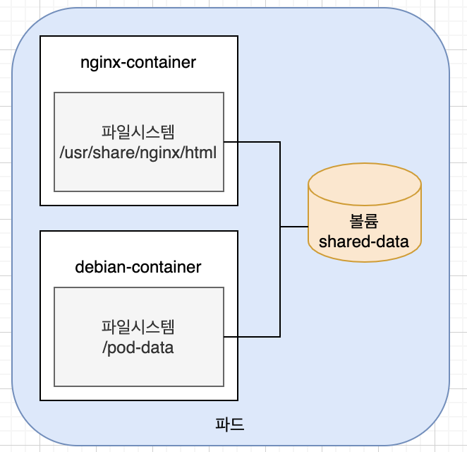
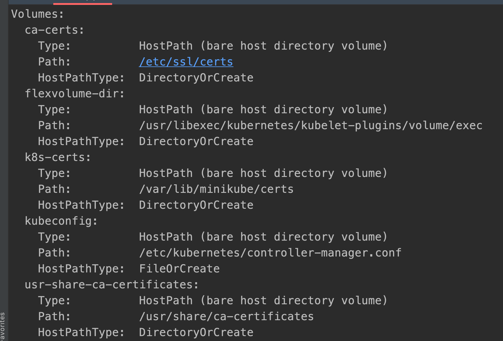
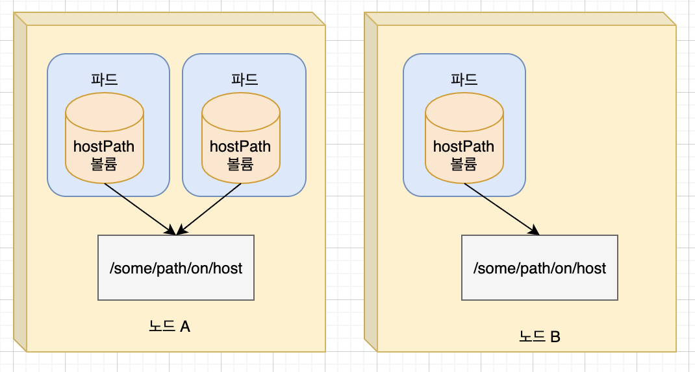
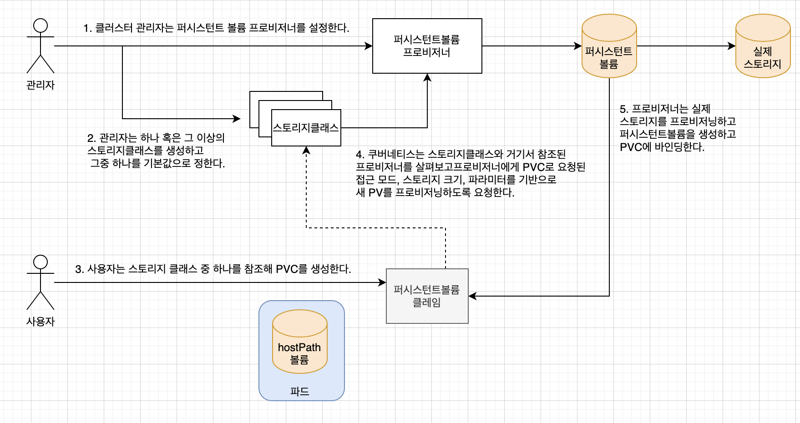

Chapter6. 볼륨 : 컨테이너에 디스크 스토리지 연결
---
### 볼륨
- 쿠버네티스 볼륨은 파드의 구성 요소로 컨테이너와 동일하게 파드 스펙에서 정의된다. 
- 독립적인 쿠베네티스 오브젝트가 아니므로 자체적으로 생성, 삭제될 수 없다.
- 접근하려는 컨테이너에서 각각 마운트되야 한다. 
- 사용가능한 볼륨 유형
    1. emptyDir : 일시적인 데이터저장
    2. hostPath : 워커 노드 파일시스템 -> 파드의 디렉토리 마운트
    3. gitRepo : 깃 리포지토리의 콘텐츠를 초기화환 볼
    4. gcpPersistentDisk, awsElasticBlockStore, azureDisk륨 : 클라우드 제공자의 전용 스토리지 마운트
    5. cinder, cephfs, iscsi ... : 네트워크 스토리지 마운트 
    6. configMap, secret, downwardAPI : 쿠버네티스 리소스나 클러스터 정보를 파드에 노출하는데 사용하는 특별한 유형의 볼륨
    7. persistentVolumeClaim : 사전에 혹은 동적으로 프로비저닝된 퍼시스턴트 스토리지

#### emptyDir
emptyDir 의 일부 용도는 다음과 같다.

- 디스크 기반의 병합 종류와 같은 스크레치 공간
- 충돌로부터 복구하기위해 긴 계산을 검사점으로 지정
- 웹 서버 컨테이너가 데이터를 처리하는 동안 컨텐츠 매니저 컨테이너가 가져오는 파일을 보관
- 환경에 따라, emptyDir 볼륨은 디스크, SSD 또는 네트워크 스토리지와 같이 노드를 지원하는 모든 매체에 저장된다. 그러나, emptyDir.medium 필드를 "Memory"로 설정하면, 쿠버네티스에 tmpfs(RAM 기반 파일시스템)를 마운트하도록 할 수 있다. tmpfs는 매우 빠르지만, 디스크와 다르게 노드 재부팅시 tmpfs가 지워지고, 작성하는 모든 파일이 컨테이너 메모리 제한에 포함된다.

참고: SizeMemoryBackedVolumes 기능 게이트가 활성화된 경우, 메모리 기반 볼륨의 크기를 지정할 수 있다. 크기를 지정하지 않으면, 메모리 기반 볼륨의 크기는 리눅스 호스트 메모리의 50%로 조정된다.


참조 링크 : https://kubernetes.io/ko/docs/concepts/storage/volumes/
pod를 띄운후 nginx 컨테이너에 접근하여 ``` curl http://localhost ``` 명령어를 실행하면 debian-container에서 작성한 내용이 나온다. 

```yaml
apiVersion: v1
kind: Pod
metadata:
  name: two-containers
spec:

  restartPolicy: Never

  volumes:
    - name: shared-data
      emptyDir: {}

  containers:

    - name: nginx-container
      image: nginx
      volumeMounts:
        - name: shared-data
          mountPath: /usr/share/nginx/html

    - name: debian-container
      image: debian
      volumeMounts:
        - name: shared-data
          mountPath: /pod-data
      command: ["/bin/sh"]
      args: ["-c", "echo debian 컨테이너에서 안녕하세요 > /pod-data/index.html"]

```

 


#### hostPath
-  노드 파일 시스템의 특정 파일이나 디렉터리를 가리킨다. 
- HostPath 볼륨에는 많은 보안 위험이 있으며, 가능하면 HostPath를 사용하지 않는 것이 좋다. HostPath 볼륨을 사용해야 하는 경우, 필요한 파일 또는 디렉터리로만 범위를 지정하고 ReadOnly로 마운트해야 한다.
- AdmissionPolicy를 사용하여 특정 디렉터리로의 HostPath 액세스를 제한하는 경우, readOnly 마운트를 사용하는 정책이 유효하려면 volumeMounts 가 반드시 지정되어야 한다.
- emptyDir 볼룸의 콘텐츠는 파드가 종료되면 삭제되는 반면, hostPath 볼륨은 삭제되지 않는다. 
- hostPath 를 그럼 사용하는 경우는 ? - 노드 로그파일이나, kubeconfig, CA인증서를 접근하기 위해 주로 사용된다. 
    1. namespace 가 kube-system인 것을 찾는다. 
    
        ```shell script
          kubectl get pod --namespace kube-system   
        ```
    
    2. minikube를 사용함으로 kube-controller-manager-minikube 를 보면 hostpath를 찾을 수 있다. 
    
        ```shell script
          kubectl describe po kube-controller-manager-minikube --namespace kube-system   
        ``` 
         
        
        

     
 
 #### persistent volumne (pv)
 https://kubernetes.io/ko/docs/concepts/storage/persistent-volumes/
- 파드에서 실행중인 애플리케이션이 디스크에서 데이터를 유지해야하고 파드가 다른 노드로 재스케줄링 된 경우에도 동일한 데이터를 보아야한다면, NAS (Network-Attached Storage) 유형에 저장돼야한다.
- 퍼시스턴트볼륨 (PV)은 관리자가 프로비저닝하거나 스토리지 클래스를 사용하여 동적으로 프로비저닝한 클러스터의 스토리지이다. 
- 노드가 클러스터 리소스인 것처럼 PV는 클러스터 리소스이다. 
- PV는 Volumes와 같은 볼륨 플러그인이지만, PV를 사용하는 개별 파드와는 별개의 라이프사이클을 가진다.        


예제 :https://kubernetes.io/ko/docs/tasks/configure-pod-container/configure-persistent-volume-storage/

예제 실습 순서 
1. minikube 노드에 index.html생성
2. hostpath 를 사용하는 pv 생성 
    - 처음 생성하면 Status=Available로 표기된다.  
    - AccessMode
        - RWO(ReadWriteOnce) : 단일 노드만이 읽기쓰기용으로 볼륨을 마운트할 수 있다.
        - ROX(ReadOnlyMany) : 다수 노드가 읽기용으로 볼륨을 마운트 할 수 있다.
        - RWX(ReadWriteMany) : 다수 노드가 읽기/쓰기용으로 볼륨을 마운트 할 수 있다.
    - pv 리클레임 정책 (persistentVolumeClaimPolicy)
        - Retain : 클레임이 해제되어도 볼륨과 콘텐츠 유지
        - Recycle :볼륨의 컨텐츠를 삭제하고 볼륨이 다시 클레임될 수 있도록 사용 가능하게 만든다. 
        - Delete : 기반 스토리지를 삭제한다. 
3. pv를 사용하는 pv claim 생성
    - pvc를 생성하면 Status 는 둘다 BOUND로 나오는데, 만일 동일 pvc를 삭제하였다가 다시 생성하면 처음 처럼 자동으로 pv에 BOUND되지 않는다. 
    - pv는 Status=Release의 상태가 되는데, 이미 볼륨을 한번 사용하였기 때문에 관리자가 완전히 비워주어야 새로운 클레임에 바인딩 할 수 있다. 
       
4. pv claim을 사용하는 pod 생성
5. pod 안에 컨테이너에 접근하여 ```curl http://localhost/``` 로 요청하였을 시 노드의 index.html 내용이 나오는지 확인

### 동적 프로비저닝 
- https://kubernetes.io/ko/docs/concepts/storage/persistent-volumes/
- 관리자가 생성한 정적 PV가 사용자의 퍼시스턴트볼륨클레임과 일치하지 않으면 클러스터는 PVC를 위해 특별히 볼륨을 동적으로 프로비저닝 하려고 시도할 수 있다. 
이 프로비저닝은 스토리지클래스를 기반으로 한다. PVC는 스토리지 클래스를 요청해야 하며 관리자는 동적 프로비저닝이 발생하도록 해당 클래스를 생성하고 구성해야 한다.

 
