Chapter7. 애플리케이션에서 파드 메타데이터와 그 외의 리소스에 액세스하기
---

이번 장에서 알아보는 주제
1. 특정 파드와 컨테이너 메타데이터를 컨테이너로 전달하는 방법
2. 컨테이너 내에서 실행 중인 애플리케이션이 쿠버네티스 API 서버와 통신해 클러스터에 배포된 리소스 정보를 얻는 방법

참고 : 
https://kubernetes.io/ko/docs/tasks/inject-data-application/environment-variable-expose-pod-information/

## Downward API로 메타데이터 전달
- 정의   
파드 및 컨테이너 필드를 실행 중인 컨테이너에 노출하는 두 가지 방법이 있고, 이를 다운워드 API라고 한다.
                                            
    > 1. 환경 변수  
    > 2. 볼륨 파일

노출 할 수 있는 정보

    1. 파드의 이름 
    2. 파드의 IP 주소
    3. 파드가 속한 네임스페이스
    4. 파드가 실행 중인 서비스와 어카운트* 이름
    5. 각 컨테이너의 CPU와 메모리 요청*
    6. 각 컨테이너의 CPU와 메모리 제한* 
    7. 파드의 레이블
    8. 파드의 어노테이션
     
 * 서비스 어카운트 (Service Account)  
        : API 서버와 통신할 때 인증하는 계정. 12장에서 더 자세히 다룸.
 * CPU/메모리 요청 및 제한  
        : 컨테이너에 보장되는 CPU와 메모리의 양과 컨테이너가 얻을 수 있는 최대의 양. 14장에서 더 자세히 다룸                                                     
 * 환경변수를 통해 전달할 수 없는 리소스는 레이블과 어노테이션으로 볼륨을 통해서만 노출 될 수 있다.
    
    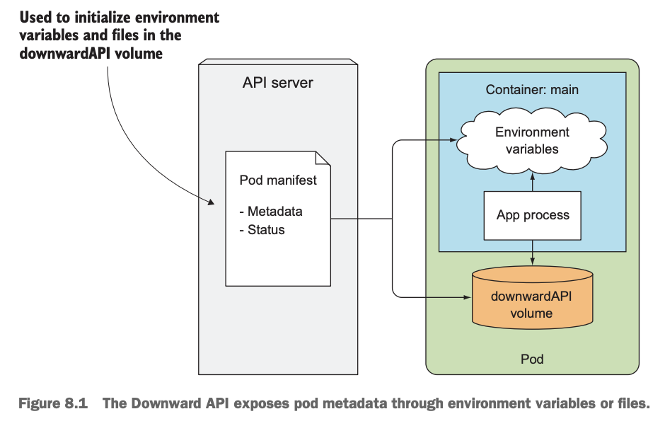 

### 환경변수로 메타데이터 노출 
1. 파드의 필드를 환경변수로 노출
    ```yaml
    apiVersion: v1
    kind: Pod
    metadata:
      name: dapi-envars-fieldref
    spec:
      containers:
        - name: test-container
          image: k8s.gcr.io/busybox
          command: [ "sh", "-c"]
          args:
            - while true; do
              echo -en '\n';
              printenv MY_NODE_NAME MY_POD_NAME MY_POD_NAMESPACE;
              printenv MY_POD_IP MY_POD_SERVICE_ACCOUNT;
              sleep 10;
              done;
          env:
            - name: MY_NODE_NAME
              valueFrom:
                fieldRef:
                  fieldPath: spec.nodeName
            - name: MY_POD_NAME
              valueFrom:
                fieldRef:
                  fieldPath: metadata.name
            - name: MY_POD_NAMESPACE
              valueFrom:
                fieldRef:
                  fieldPath: metadata.namespace
            - name: MY_POD_IP
              valueFrom:
                fieldRef:
                  fieldPath: status.podIP
            - name: MY_POD_SERVICE_ACCOUNT
              valueFrom:
                fieldRef:
                  fieldPath: spec.serviceAccountName
      restartPolicy: Never
    ```
    * fieldPath는 값을 참고할 경로를 나타내는데 파일을 생성후 ``` kubectl get po -o yaml ``` 명령어로 쉽게 참조 필드를 확인할 수 있다.
    * 설정한 환경변수는 파드에 접근하여서 모든 환경변수를 확인하면서도 볼 수 있다. ``` kubectl exec dapi-envars-fieldref -- env```
    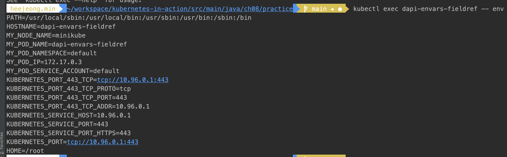 
    
2. 컨테이너의 필드를 환경변수로 노출
```yaml
apiVersion: v1
kind: Pod
metadata:
  name: dapi-envars-resourcefieldref
spec:
  containers:
    - name: test-container
      image: k8s.gcr.io/busybox:1.24
      command: [ "sh", "-c"]
      args:
      - while true; do
          echo -en '\n';
          printenv MY_CPU_REQUEST MY_CPU_LIMIT;
          printenv MY_MEM_REQUEST MY_MEM_LIMIT;
          sleep 10;
        done;
      resources:
        requests:
          memory: "32Mi"
          cpu: "125m"
        limits:
          memory: "64Mi"
          cpu: "250m"
      env:
        - name: MY_CPU_REQUEST
          valueFrom:
            resourceFieldRef:
              containerName: test-container
              resource: requests.cpu
        - name: MY_CPU_LIMIT
          valueFrom:
            resourceFieldRef:
              containerName: test-container
              resource: limits.cpu
        - name: MY_MEM_REQUEST
          valueFrom:
            resourceFieldRef:
              containerName: test-container
              resource: requests.memory
        - name: MY_MEM_LIMIT
          valueFrom:
            resourceFieldRef:
              containerName: test-container
              resource: limits.memory
  restartPolicy: Never
```

### downwardAPI 볼륨에 파일로 메타데이타 전달
위의 예시 처럼 환경변수 대신, 파일로 메타데이터를 노출 할 수도 있다. downwardAPI 볼륨을 정의하고, 컨테이너에 마운트하면 가능하다.  
1. 파드 필드 저장하기

    ```yaml
    apiVersion: v1
    kind: Pod
    metadata:
      name: kubernetes-downwardapi-volume-example
      labels:
        zone: us-est-coast
        cluster: test-cluster1
        rack: rack-22
      annotations:
        build: two
        builder: john-doe
    spec:
      containers:
        - name: client-container
          image: k8s.gcr.io/busybox
          command: ["sh", "-c"]
          args:
            - while true; do
              if [[ -e /etc/podinfo/labels ]]; then
              echo -en '\n\n'; cat /etc/podinfo/labels; fi;
              if [[ -e /etc/podinfo/annotations ]]; then
              echo -en '\n\n'; cat /etc/podinfo/annotations; fi;
              sleep 5;
              done;
          volumeMounts:
            - name: podinfo
              mountPath: /etc/podinfo
      volumes:
        - name: podinfo
          downwardAPI:
            items:
              - path: "labels"
                fieldRef:
                  fieldPath: metadata.labels
              - path: "annotations"
                fieldRef:
                  fieldPath: metadata.annotations
    
    ```
    * downwardAPI 하위의 배열 요소는 DownwardAPIVolumeFile이다.
        - https://kubernetes.io/docs/reference/generated/kubernetes-api/v1.22/#downwardapivolumefile-v1-core
        - DownwardAPIVolumeFile : 파드의 필드를 포함하고 있는 파일을 생성하는 정보를 담고 있다.
       
        - ```kubectl create``` vs ```kubectl apply``` https://stackoverflow.com/questions/47369351/kubectl-apply-vs-kubectl-create
        
        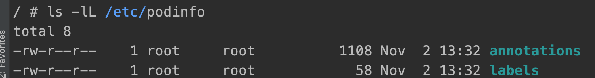 
        
        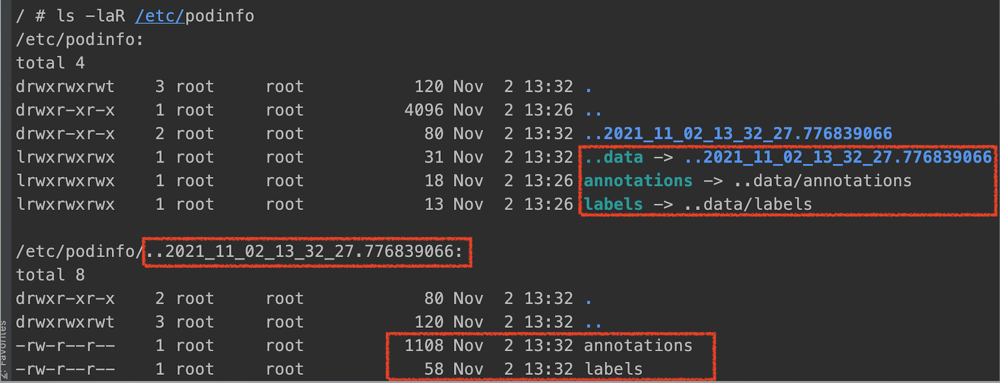 
        - 임시 하위 디렉토리에 label, annotations 파일이 있고, /etc/podinfo 디렉토리에서 심볼릭 링크로 연결되어 있다. 
          업데이트가 일어나면, 새 임시 디렉토리에 기록되고, 심볼링 링크가 갱신한다. 
          
        - label 변경해보기 
         ```shell script
            kubectl label pod kubernetes-downwardapi-volume-example rack=rack-1 --overwrite  
         ```
         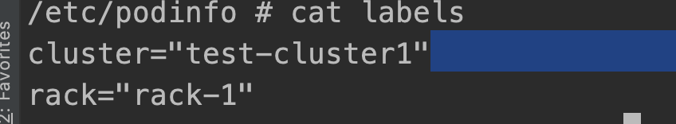 

          
2. 컨테이너 정보 저장하기 
  - 컨테이너 수준의 메타데이터를 노출할때에는 리소스 필드를 참조하는 컨테이너 이름을 지정해야 한다.
  - 볼륨을 사용하는 경우, 환경변수를 사용하는 것보다 더 복잡하지만, 필요한 경우 한 컨테이너의 리소스 필드를 다른 컨테이너에 전달 할 수 있다. (동일 파드 안에 있어야함)
    ```yaml
    apiVersion: v1
    kind: Pod
    metadata:
      name: kubernetes-downwardapi-volume-example-2
    spec:
      containers:
        - name: client-container
          image: k8s.gcr.io/busybox:1.24
          command: ["sh", "-c"]
          args:
            - while true; do
              echo -en '\n';
              if [[ -e /etc/podinfo/cpu_limit ]]; then
              echo -en '\n'; cat /etc/podinfo/cpu_limit; fi;
              if [[ -e /etc/podinfo/cpu_request ]]; then
              echo -en '\n'; cat /etc/podinfo/cpu_request; fi;
              if [[ -e /etc/podinfo/mem_limit ]]; then
              echo -en '\n'; cat /etc/podinfo/mem_limit; fi;
              if [[ -e /etc/podinfo/mem_request ]]; then
              echo -en '\n'; cat /etc/podinfo/mem_request; fi;
              sleep 5;
              done;
          resources:
            requests:
              memory: "32Mi"
              cpu: "125m"
            limits:
              memory: "64Mi"
              cpu: "250m"
          volumeMounts:
            - name: podinfo
              mountPath: /etc/podinfo
      volumes:
        - name: podinfo
          downwardAPI:
            items:
              - path: "cpu_limit"
                resourceFieldRef:
                  containerName: client-container
                  resource: limits.cpu
                  divisor: 1m
              - path: "cpu_request"
                resourceFieldRef:
                  containerName: client-container
                  resource: requests.cpu
                  divisor: 1m
              - path: "mem_limit"
                resourceFieldRef:
                  containerName: client-container
                  resource: limits.memory
                  divisor: 1Mi
              - path: "mem_request"
                resourceFieldRef:
                  containerName: client-container
                  resource: requests.memory
                  divisor: 1Mi
    ```    
    
## 쿠버네티스 API 서버와 통신하기
downward API를 사용하면 파드/컨테이너의 메타데이터를 쉽게 노출할 수 있지만, 대신 사용 가능한 메타데이터가 한정적이다. 
애플리케이션이 다른 리소스의 정보/최신 데이터에 접근해야하는 경우 API 서버와 직접 통신해야한다. 

 

실습 파일 
```yaml
apiVersion: v1
kind: Pod
metadata:
    name: curl
spec:
 containers:
   - name: main
     image: curlimages/curl
     command: ["sleep", "9999999"]
```

1. API 서버에 접속하는 방법 - proxy로 서버와 통신하기 
```kubernetes 
    kubectl proxy --port=8080
    curl localhost:8080/apis/batch
```
--port 옵션을 사용하면 임의로 포트를 정할 수 있다. 

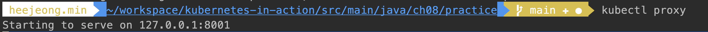 
 
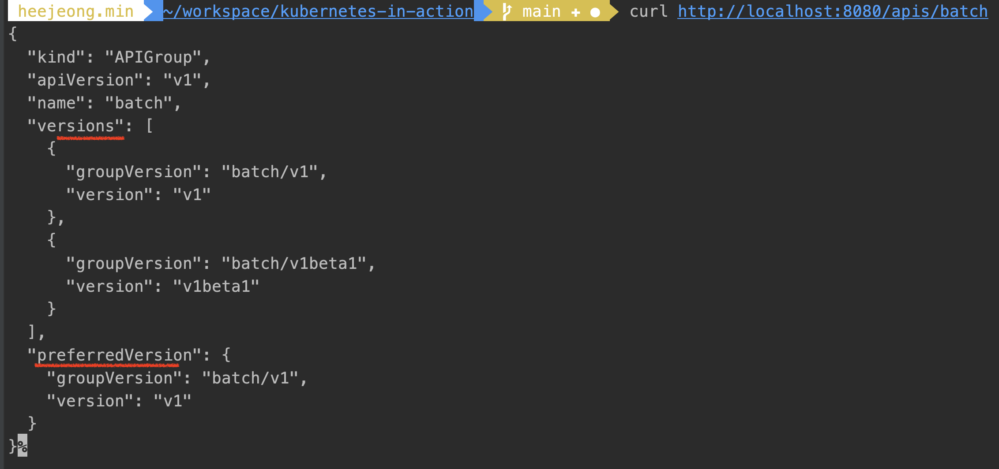 


2. 파드 내에서 API 서버와 통신
    - 순서
        - API 서버와 통신할 파드 실행
          : 책에 tumtum/curl 이미지를 받아오게 되어 있는데 현재 없는 것같음. 
        ```yaml
          apiVersion: v1
          kind: Pod
          metadata:
              name: curl
          spec:
           containers:
             - name: main
               image: curlimages/curl
               command: ["sleep", "9999999"]
        ```
        - 서버 주소 찾기
          : chapter05 - FQDN을 통한 서비스 연결
          
        ```kubernetes
            kubectl get svc
        ``` 
        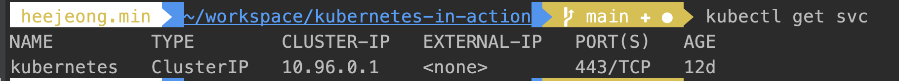 
        
        : NAME으로 간단하게 접근할 수 있지만 IP/포트를 컨테이너 내부에서도 확인할 수 있다.
        ```kubernetes
             kubectl exec -it curl -- sh
             env
        ``` 
        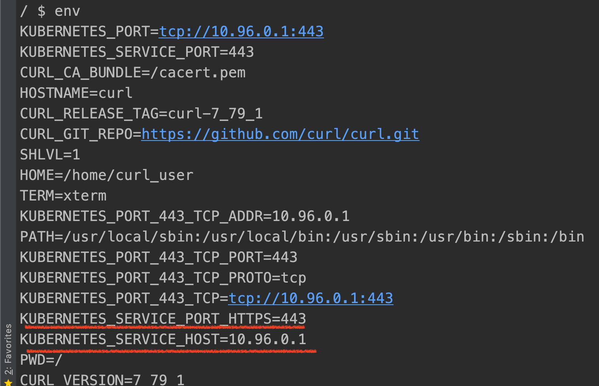 
        
        - 서버 아이덴티티검증 (https://kubernetes.io/docs/tasks/run-application/access-api-from-pod/)
            - 간단히 -k 옵션을 주어서 우회할 수 있지만 책 실습은 인증서와 토큰을 사용하여 API접속
            ```kubernetes
              # Point to the internal API server hostname
              APISERVER=https://kubernetes.default.svc
              
              # Path to ServiceAccount token
              SERVICEACCOUNT=/var/run/secrets/kubernetes.io/serviceaccount
              
              # Read this Pod's namespace
              NAMESPACE=$(cat ${SERVICEACCOUNT}/namespace)
              
              # Read the ServiceAccount bearer token
              TOKEN=$(cat ${SERVICEACCOUNT}/token)
              
              # Reference the internal certificate authority (CA)
              CACERT=${SERVICEACCOUNT}/ca.crt
              
              # Explore the API with TOKEN
              curl --cacert ${CACERT} --header "Authorization: Bearer ${TOKEN}" -X GET ${APISERVER}/api
            ```
           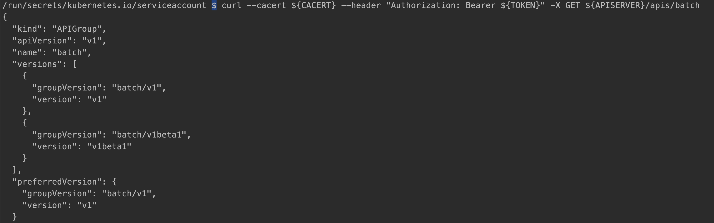 

         - namespace 를 확인해보면 default인데, 해당 네임스페이스 아래 생성된 모든 파드를 조회해보고 싶다면 다음과 같이 요청할수 있다.
           ```shell script
              curl --cacert ${CACERT} --header "Authorization: Bearer ${TOKEN}" -X GET ${APISERVER}/api/v1/namespaces/default/pods
           ``` 
             하지만 Forbidden이라고 나오는데, 역할기반액세스가 활성화 되어 있어서 그렇다고 한다. 
             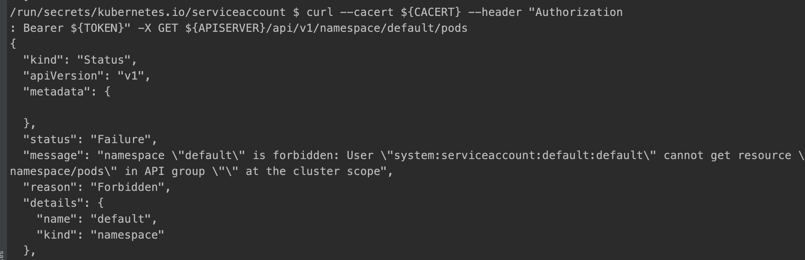 
         
         - 나의 serviceaccount 찾기 
             ```shell script
              kubectl get serviceaccount
             ```
             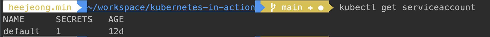 
         
         - 나의 serviceaccount에게 cluster-admin 권한주기
             ```shell script
                 kubectl create clusterrolebinding permissive-binding \
                 --clusterrole=cluster-admin \
                 --group=system:serviceaccounts
             ```
             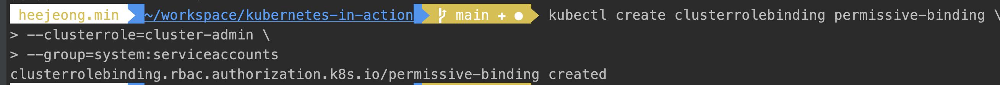 
             
         - 나의 serviceaccount에게 권한 부여 후 다시 시도
             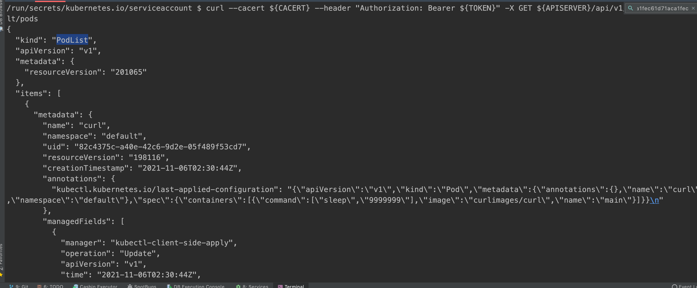 
         - pod 삭제 해보기  
             - https://coffeewhale.com/apiserver
             - https://docs.openshift.com/container-platform/3.5/rest_api/kubernetes_v1.html
            ```shell script
             curl --cacert ${CACERT} --header "Authorization: Bearer ${TOKEN}" -X DELETE ${APISERVER}/api/v1
             /namespaces/default/pods/kubernetes-downwardapi-volume-example
            ```
           
        정리 
        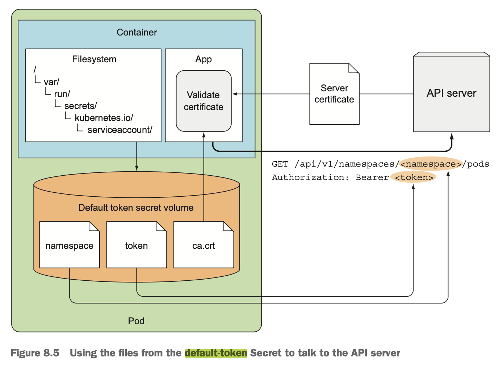 

kubectl create clusterrolebinding permissive-binding --clusterrole=cluster-admin --group=system:serviceaccounts
 

## 앰버서더 컨테이너를 이용한 API 서버 통신 간소화
인증을 통한 API 통신 복잡하다. 파드내에서도 ```kubectl proxy```를 사용하였던 것처럼 사용할 수 있는 방법이 
앰배서더 컨테이너 패턴 이다. 
- HTTPS 대신 HTTP로 파드 내에서 앰배서더 컨테이너에 연결 (한 파드 안의 컨테이너는 동일 네트워크 인터페이스 공유)
- 앰배서더 컨테이너가 프록시 역할을 하면서 API서버에 대한 HTTPS 연결을 하도록 처리.
- 외부 서비스 연결의 복잡성을 숨기고, 메인 컨테이너에서 실행하는 애플리케이션을 단순화 할 수 있고, 앰배서더 컨테이너는 재사용이 가능하다. 


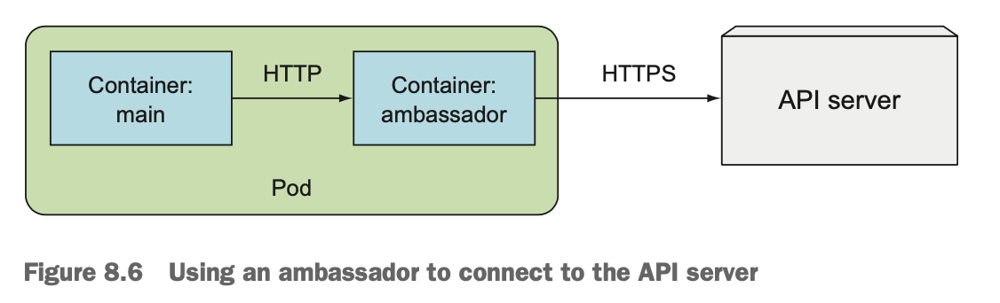 

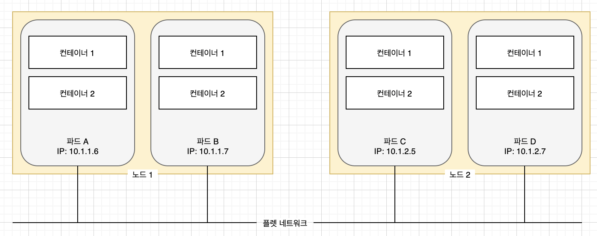

- 앰배서더 컨테이너를 활용한 curl 파드 실행
```yaml
apiVersion: v1
kind: Pod
metadata:
  name: curl-with-ambassador
spec:
  containers:
    - name: main
      image: curlimages/curl
      command: ["sleep", "9999999"]
    - name: ambassador
      image: luksa/kubectl-proxy:1.6.2
```

- 파드 실행 후 main 컨테이너로 들어가서 localhost:8001 요청 바로 가능 
```shell script
kubectl exec -it curl-with-ambassador -c main -- sh
curl localhost:8001
```
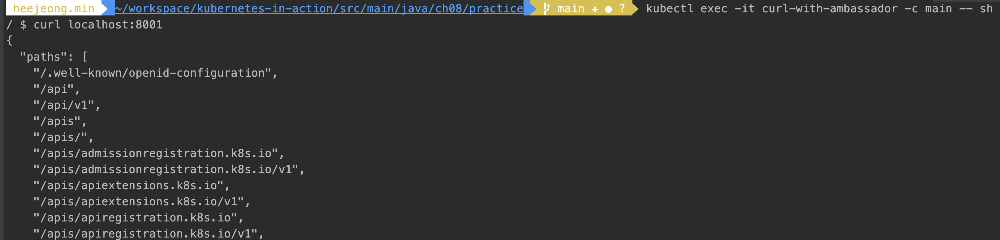  
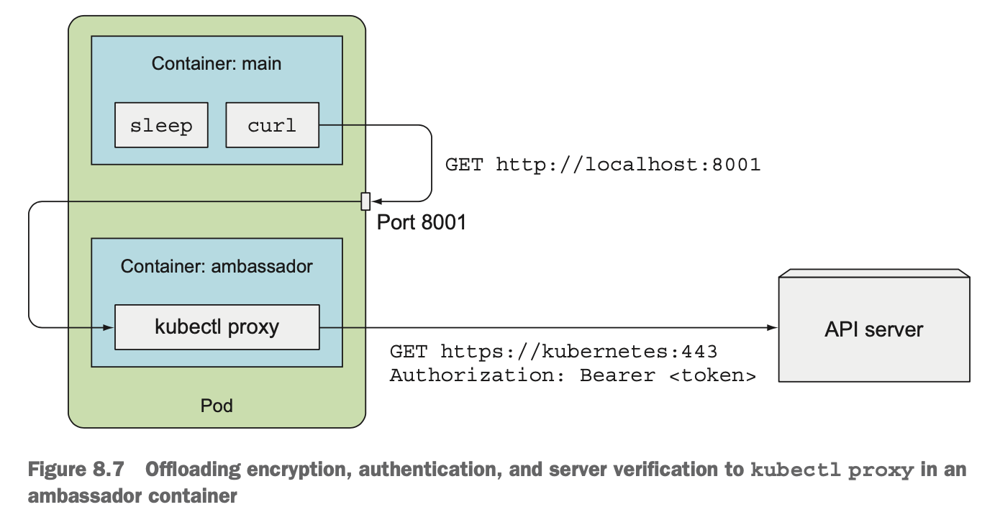


## 클라이언트 라이브러리를 사용해 API 서버와 통신하는 방법
https://kubernetes.io/docs/tasks/administer-cluster/access-cluster-api/  
https://www.baeldung.com/kubernetes-java-client
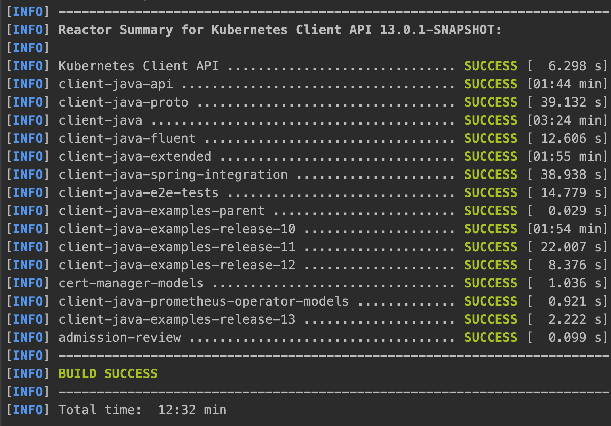  

1. 의존성을 추가한다. 
```
	implementation group: 'io.kubernetes', name: 'client-java', version: '11.0.0'
```

2. java client를 사용하는 코드 작성 
```java

    ApiClient client = Config.defaultClient();
    Configuration.setDefaultApiClient(client);

    CoreV1Api api = new CoreV1Api();
    V1NodeList nodeList = api.listNode(null, null, null, null, null, null, null, null, 10, false);
    nodeList.getItems()
        .stream()
        .forEach((node) -> System.out.println(node));

    String localHostAddress = InetAddress.getLocalHost().getHostAddress();
    String localHostName = InetAddress.getLocalHost().getHostName();

    String remoteHostAddress = InetAddress.getLoopbackAddress().getHostAddress();
    String remoteHostName = InetAddress.getLoopbackAddress().getHostName();

```
* api를 호출하였을 때 위 코드가 실행되게 하였고, 로그로 찍었으니 파드의 로그를 확인해 본다. 
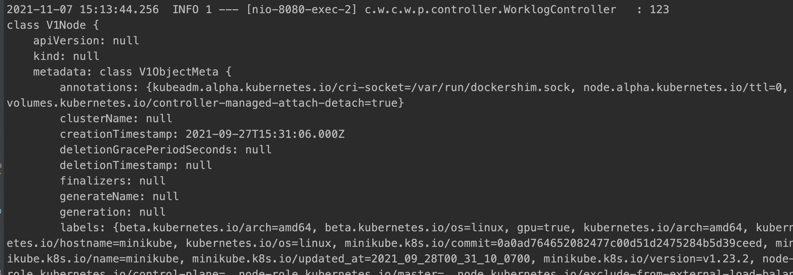  


#### 스웨거 UI로 API 살펴보기
- minikube로 띄울때 swagger ui 활성화 옵션을 책, 인터넷에 비슷하게 생긴 옵션들을 시도하였으나 모두 찾을 수 없다고 나옴. 
- https://stackoverflow.com/questions/65007886/how-to-reach-openapi-interface-for-minikube

1. swagger 문서를 호스트에 임시로 저장하기
```shell script
kubectl proxy
curl localhost:8001/openapi/v2 > /tmp/temp.json
```
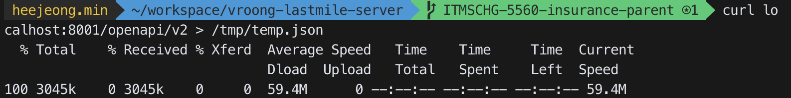  

2. swaggerapi/swagger-ui 이미지를 받아서 컨테이너로 실행하고, 미리 저장해 둔 swagger 문서는 마운트한다. 
```shell script
docker run -it -p 9999:8080 -e SWAGGER_JSON=/var/specs/temp.json -v /tmp/temp.json:/var/specs/temp.json swaggerapi/swagger-ui
```

3. 브라우저를 열고 ```localhost:9999``` 요청하여 api를 확인할 수 있다.  
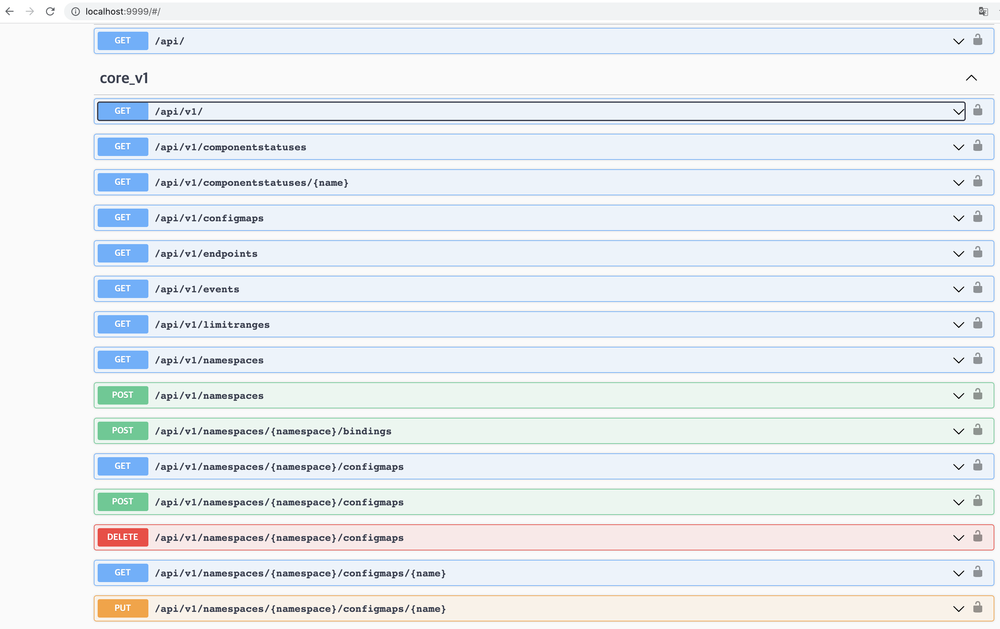  
