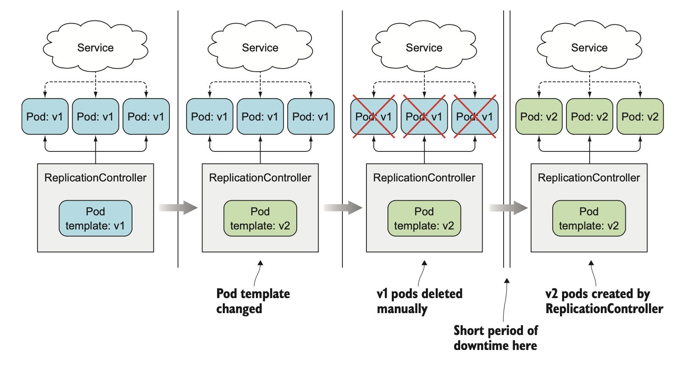
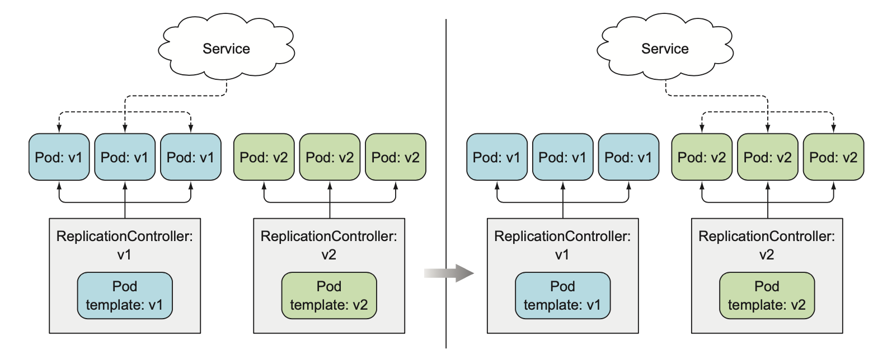
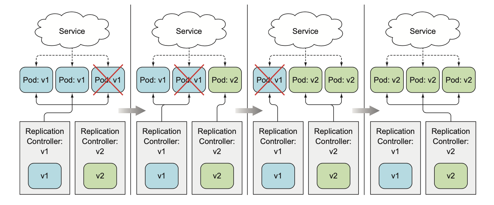
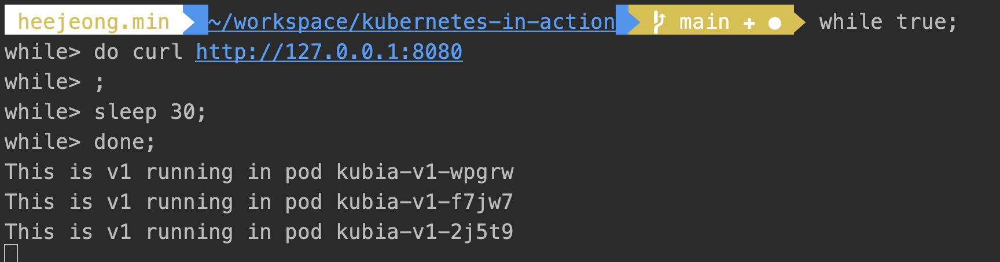
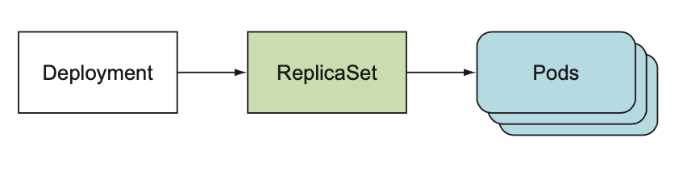
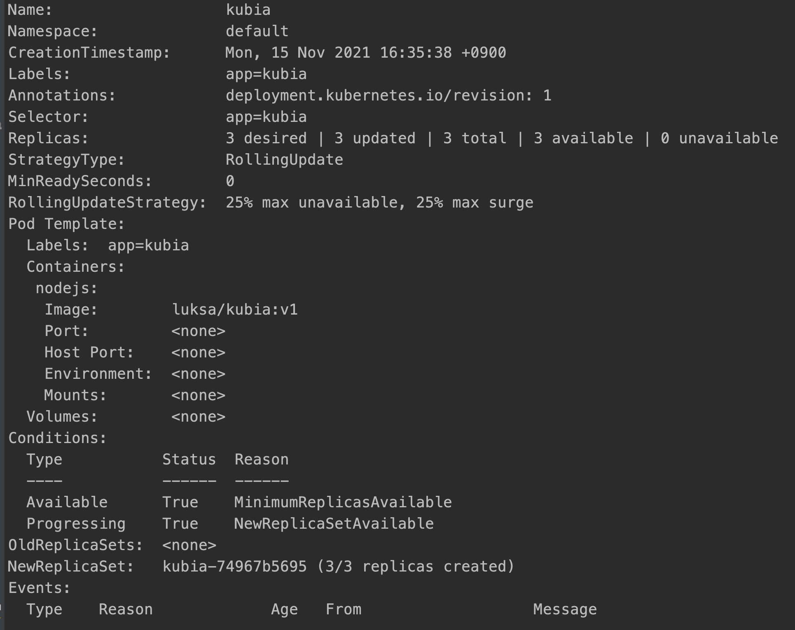
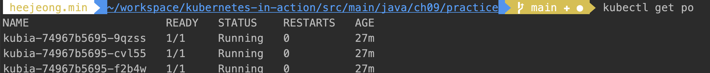
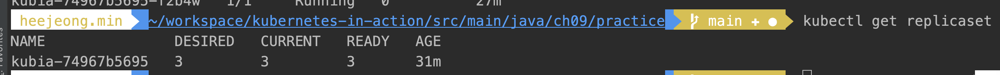

Chapter 9. 디플로이먼트: 선언적 애플리케이션 업데이트
---

## 파드에서 실행 중인 애플리케이션 업데이트
현재 이미지의 버전이 v1이고, 최신 버전의 애플리케이션을 개발해 v2로 태그가 지정되는 경우가 있다고 가정하였을 시 
모든 파드를 업데이트하는 방법은 두 가지가 있을 수 있고, 수동/자동 둘다 가능하다. 

1. 기존 파드를 모두 삭제한 다음 새 파드를 시작한다. 
    - 단점 : 짧은 시간동은 애플리케이션을 사용할 수 없다.
2. 새로운 파드를 시작하고, 기동하면 기존 파드를 삭제한다. 새 파드를 모두 추가한 후 한꺼번에 기존파드를 삭제하거나 순차적으로 새 파드를 추가하고 기존 파드를 점진적으로 제거할 수도 있다.
    - 단점 : 동시에 두 가지 버전이 실행된다. 애플리케이션이 데이터 저장소에 데이터를 저장하는 경우 새 버전이 이전 버전을 손상시킬 수 있는 
    데이터 스키마나 데이터의 수정을 해서는 안된다.
    
### 오래된 파드를 삭제하고 새 파드로 교체
- 레플리케이션컨트롤러는 새 인스턴스를 생성할 때 업데이트된 파드 템플릿을 사용한다.  

 -> v1 파드 세트를 관리하는 레플리케이션 컨트롤러의 이미지 버전을 v2를 참조하도록 템플릿을 수정한 다음 이전 파드 인스턴스를 삭제해 쉽게 교체할 수 있다.  
 -> 레플리케이션컨트롤러는 레이블 셀렉터와 일치하는 파드가 없다면 새로운 인스턴스를 시작한다. 
 -> 만일 이전 파드가 삭제되고 짧은 시간 동안 다운타임을 허용한다면 가장 간단한 방법이다.
 
   

### 새 파드 기동과 이전 파드 교체
#### 한 번에 이전 버전에서 새 버전으로 전환 
- 블루-그린 디플로이먼트 
    1. 파드 앞의 서비스는 새 버전의 파드를 불러오는 동안 이전 버전과 연결된다. 
    2. 새 파드가 모두 실행되면, 서비스의 레이블 셀렉터를 변경하고 새 파드를 바라보게 한다.  
        ```shell script
           kubectl set selector
        ``` 
    3. 전환 후 새 버전이 올바르게 작동하면 이전 레플리케이션컨트롤러를 삭제하여 이전 파드를 삭제할 수 있다.
    
      
 

#### 롤링 업데이트 수행 
- 파드를 단계별로 교체하는 방법으로 천천히 scale down/up을 진행한다. 서비스의 파드 셀렉터에 이전 파드와 새 파드를 모두 포함하게 한다. 

  


## 레플리케이션컨트롤러로 자동 롤링 업데이트 수행
### 애플리케이션의 초기 버전 실행

1. 파드 3개와 로드밸런서 1 개를 만든다. 
```yaml
apiVersion: v1
kind: ReplicationController
metadata:
  name: kubia-v1
spec:
  replicas: 3
  template:
    metadata:
      name: kubia
      labels:
        app: kubia
    spec:
      containers:
      - image: luksa/kubia:v1
        name: nodejs
---
apiVersion: v1
kind: Service
metadata:
  name: kubia
spec:
  type: LoadBalancer
  selector:
    app: kubia
  ports:
    - port: 8080
      targetPort: 8080 
```
- 파드와 로드밸런서를 띄운후 curl 요청을 날리는 스크립트를 실행해 놓는다.  
```shell script
while true;
do curl http://127.0.0.1:8080;
sleep 30;
done
```

  

2. kubectl을 이용한 롤링업데이트
새로운 이미지를 받아서 업데이트하도록 명령어를 실행한다. 
```shell script
kubectl rolling-update kubia-1 kubia-2 --image=luksa/kubia:v2
```
> rolling-update 명령어 사라짐. 


## 애플리케이션을 선언적으로 업데이트하기 위한 디플로이먼트 사용하기
- 낮은 수준의 개념으로 간주되는 리플리케이션컨트롤러 또는 레플리카셋을 통해 수행하는 대신, 애플리케이션을 배포하고, 선언적으로 
업데이트하기 위한 높은 수준의 리소스가 디플로이먼트이다.
- 디플로이먼트를 생성하면 리플리카셋 리소스가 그 아래 생성이 된다. 리플리카셋은 차세대 리플리케이션컨트롤러이므로, 레플리케이션 컨트롤러 대신 레플리카셋을 사용해야 한다.
- 디플로이먼트를 사용하는 경우, 실제 파드는 디플로이먼트가 아닌 디플로이먼트의 리플리카셋에 의해 생성되고 관리된다. 

      
    
### 디플로이먼트 생성
```yaml
apiVersion: apps/v1
kind: Deployment
metadata:
  name: kubia
  labels:
    app: kubia
spec:
  replicas: 3
  selector:
    matchLabels:
      app: kubia
  template:
    metadata:
      name: kubia
      labels:
        app: kubia
    spec:
      containers:
        - name: nodejs
          image: luksa/kubia:v1
```

### 디플로이먼트 롤아웃 상태 출력
일반적인 디플로이먼트 세부 사항 보기 
```shell script
kubectl get deployment
kubectl describe deployment
``` 
  

디플로이먼트 상태를 보기 위한 명령어
```shell script
kubectl rollout status deployment kubia
```
디플로이먼트로 생성하게 되면 레플리케이션컨트롤러와 다른점은 컨트롤러 이름과 임의로 생성된 문자열로 구성에서 중간에 숫자가 추가되는 다른점이 있다.  
  
- 이 숫자가 의미하는 것은, 디플로이먼트와 파드 템플릿의 해시값을 의미하며, 레플리카셋이 이런 파드를 관리한다. 
: <디플로이먼트 이름>-<레플리카셋 해시값>-<파드 해시값>
  


### 디플로이먼트 업데이트
- 사용 가능한 디플로이먼트 전략
    - 기본은 RollingUpdate라는 롤링 업데이트 전략이다.
    - 대안으로 Recreate 전략이 있는데, 수정 후 모든 파드를 삭제 후 진행하기 때문에 다운타임이 생긴다. 
    
- 데모 목적으로 롤링 업데이트 속도 느리게 하기


