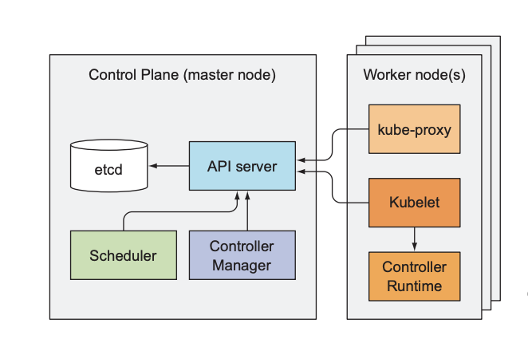

Chapter 11. 쿠버네티스 태부 이해
---

## 아키텍처 이해  
쿠버네티스 클러스터는 다음 2가지로 나뉜다.  
1. 컨트롤 플레인 구성 요소  
클러스터 기능을 제어하고 전체 클러스터가 동작하게 만드는 역할로 다음과 같은 구성요소를 가진다. 
    1. etcd 분산 저장 스토리지
    2. API 서버
    3. 스케줄러
    4. 컨트롤러 매니저

2. 워크 노드에서실행하는 구성요소  
컨테이너를 실행하는 작업은 각 워커 노드에 실행되는 구성 요소가 담당된다. 
    1. Kubelet
    2. 쿠버네티스 서비스 프록시(kube-proxy)
    3. 컨테이너 런타임(Docker, rkt외 기타)
    
3. 그외 애드온 구성 요소 
    1. 쿠버네티스 DNS 서버
    2. 대시보드
    3. 인그레스 컨트롤러 
    4. 힙스터
    5. 컨테이너 네트워크 인터페이스
    
위의 구성요소들은 모두 개별 프로세스로 실행되며, 구송요소와 구성요소 간의 상호종속성은 다음과 같다. 

 

컨트롤 플레인 구성 요소의 상태 확인 
- API 서버는 각 컨트롤 플레인 구성 요소의 상태를 표시하는 ComponentStatus라는 API 리소스를 제공한다.  
```kubectl get componentstatuses```

### 구성 요소가 서로 통신하는 방법
- 쿠버네티스 시스템 구성요소는 오직 API 서버와만 통신하고, 서로 직접 통신하지 않는다.
- API 서버는 etcd와 통신하는 유일한 구성요소이다. 
- 다른 구성요소는 etcd와 직접 통신하지 않고 API 서버로 클러스터 상태를 변경한다.

### 쿠버네티스가 etcd를 사용하는 방법
- 모든 오브젝트는 API서버가 다시 시작되거나 실패되더라도 유지하기 위해 매니페스트가 영구적으로 저장될 필요가 있다. 
- 따라서, 키-값 저장소를 제공하는 etcd를 사용하여 저장한다. 
- 리소스를 etcd에 저장하는 방법
    - 쿠버네티스는 모든 데이터를 /registry 아래에 저장한다.
    
### API 서버의 기능
- 클러스터 상태를 조회하고 변경하기 위해 RESTFul API로 CRUD 인터페이스를 제공한다. 
- 오브젝트를 etcd에 저장하는 일관된 방법을 제공하는 것 뿐만 아니라, 오브젝트 유효성 검사 작업도 수행하기 때문에 잘못 설정된 오브젝트를 저장할 수 없다. 
- 유효성 검사와 함께 낙관적 잠금도 처리하기 때문에 동시에 업데이트가 발생하더라도 다른 클라이언트에 의해 오브젝트의 변경 사항이 재정의 되지 않는다. 

### API 서버가 리소스 변경을 클라이언트에 통보하는 방법
- 클라이언트는 API 서버에 HTTP연결을 맺고 변경 사항을 감지한다. 클라이언트는 감시 대상 오브젝트의 변경을 알 수 있는 스트림을 받는다. 
- kubectl도구는 리소스 변경을 감시할 수 있는 API 서버의 클라이언트 중 하나이다. --watch 옵션을 사용하면 파드의 생성, 수정, 삭제 통보를 받을 수 있다.
    ```kubectl get pods --watch```
- kubectl 명령으로 각 감시 이벤트의 전체 YAML을 출력할 수도 있다. 
    ```kubectl get pods -o yaml --watch```
    
### 스케줄러 이해
- 스케줄러는 API서버로 파드 정의를 갱신하지, 선택된 노드에 파드를 실행하도록 지시하지 않는다. 
- API 서버가 Kubelet에게 파드가 스케줄링 된 것을 통보하게 되고, Kubelete은 파드가 해당 노드에 스테줄링된것을 확인하면 파드를 생성하고 실행한다. 

## 컨트롤러 매니저에서 실행되는 컨트롤러 소개  
컨트롤러는 다양한 작업을 수행하지만 모두 API서버에서 리소스가 변경되는 것을 감지하고 각 변경 작업을 수행한다.   
1. 레플리케이션 매니저
    - 레플리케이션 컨트롤러 리소스를 활성화하는 역할을 하며, API 서버로 파드 API 오브젝트를 조작해 작업을 수행한다. 
    
2. 레플리카셋, 데몬셋, 잡 컨트롤러
    - 레플리카셋은 레플리케이션 매니저와 거의 동일한 기능을 수행한다. 
    - 데몬셋과 잡 컨트롤러는 리소스에 정의된 파드 템플릿에서 파드 리소스를 생성하는 역할을 한다. 

3. 디플로이먼트 컨트롤러
    - 실제 배포된 상태와 디플로이먼트 API 오브젝트에 기록된 원하는 상태가 동기화 되도록 관리한다. 
    
4. 스테이트풀셋 컨트롤러
    - 스테이트풀셋 리소스 정의에 따라 파드를 생성, 관리, 삭제한다. 
    - 다른 컨트롤러는 파드만 관리하는 한, 스테이트풀 컨트롤러는 각 파드 인스턴스를 위한 퍼시스턴트볼륨 클레임도 관리한다. 
    
5. 노드 컨트롤러
    - 클러스터의 워커 노드를 기술하는 노드 리소스를 관리한다. 
    - 실행중인 실제 머신 목록과 노드 오브젝트 목록을 동기화하는데 중점을 둔다. 
    
6. 서비스 컨트롤러
    - 서비스 컨트롤러는 몇가지 유형이 있는데 그중 하나는 LoadBalancer이다. 
    
7. 엔드포인트 컨트롤러
    - 레이블 섹렉터와 일치하는 파드의 IP와 포트로 엔드 포인트 리스트를 계속 갱신하는 활성 구성요소이다. 
    
8. 네임스페이스 컨트롤러
    - 네임스페이스 오브젝트의 삭제 통보를 받으면 API 서버로 네임스페이스에 속해 있는 모든 리소스를 삭제한다. 
    
9. 퍼시스턴트볼륨 컨트롤러
    - 사용자가 퍼시스턴트볼륨클레임을 생성하면, 쿠버네티스는 적절한 퍼시스턴트 볼륨을 찾아 해당 클레임에 연결해 주는 역할을 한다. 
    
10. 그 밖의 컨트롤러
    - Kubelet
    - kube-proxy

### Kubelet
1. 노드에서 실행하는 모든 것을 담당하는 구성요소로, 첫번째 작업은 실행중인 노드를 노드 리소스로 만들어서 API 서버에 등록한다. 
2. 그 후, API 서버를 지속적으로 모니터링하여, 해당 노드에 파드가 스케줄링되면, 파드의 컨테이너를 시작한다. 
3. 실행중인 컨테이너를 또한 계속 모니터링하면서 상태, 이벤트, 리소스 사용량을 API 서버에 보고한다. 
4. 컨테이너 라이브니스 프로브를 실행하는 구성요소이기도 하며, 프로브가 실패할 경우 컨테이너를 다시 시작한다. 
5. API 서베에서 파드가 삭제되면 컨테이너를 정지하고, 파드가 종료된것을 서버에 통보한다. 

### kube-proxy
1. 모든 워크 노드가 클라이언트가 쿠버네티스 API로 정의한 서비스에 연결할 수 있도록 해주는 역할

## 쿠버네티스 애드온 소개
### DNS 서버 동작방식
- 클러스터의 모든 파드는 기본적으로 클러스터 내부 DNS 서버를 사용하도록 설정되어 있다.
- 그렇기 때문에 파드는 서비스를 이름으로 쉽게 찾을 수 있고, headless 서비스 파드인 경우 해당 파드읜 IP주소를 조회할 수 있다. 
- DNS 서버 파드는 kube-dns 서비스로 노출됨으로, 해당 파드를 다른 파드와 마찬가지로 클러스터 안에서 이동할 수 있다. 
- /etc/resolv.conf 파일 안에 nameserver로 지정되어 있다. 

### 인그레스 컨트롤러 동작 방식
- 리버스 프록시 서버를 실행하고 클러스터에 정의된 인그레스, 서비스, 엔드포인트 리소스 설정을 유지한다.
- 인그레스 리소스의 정의는 서비스를 가리키지만, 인그레스 컨트롤러는 트래픽을 서비스의 IP로 보내지 않고 서비스의 파드로 직접 전달한다.  

    


